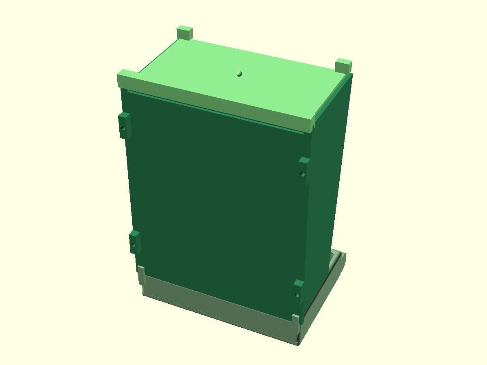

# 3d-models

OpenSCAD sources and renders. Each directory is one model with its own README, source, and renders. STLs are not checked in; each is one `openscad` call away (see the model's README).

| model | description | thumbnail |
|---|---|---|
| [hopper](hopper) | Parametric seed hopper for a green-cheek conure feeder: wedge body filling a 140 × 170 mm cage door, ~1 L, refilled from outside, hull-lipped tray with perch. One spec, several models' answers. |  |

MIT, see [LICENSE](LICENSE).
