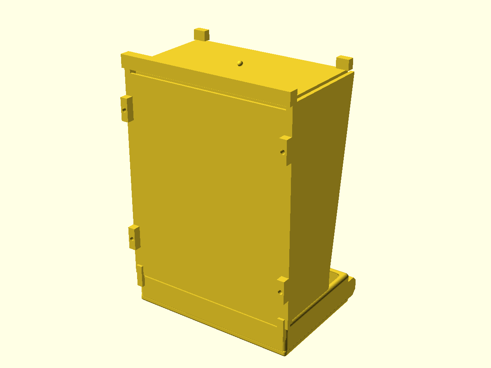
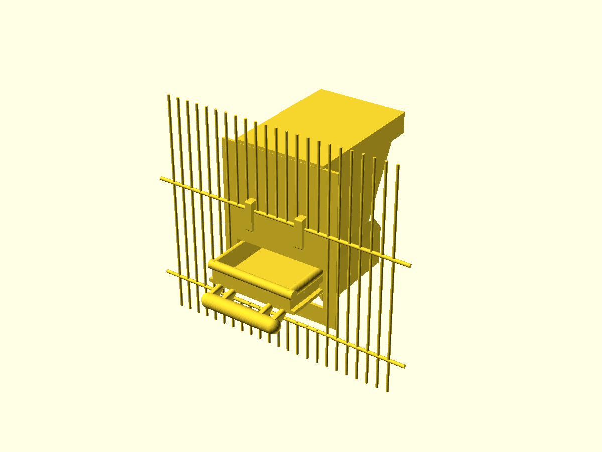
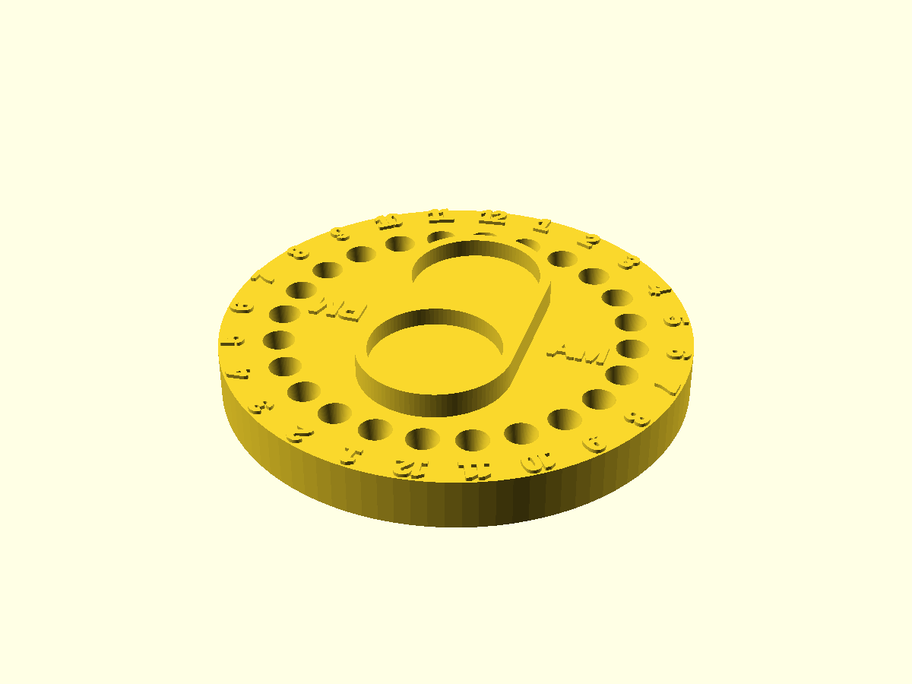

# 3d-models

OpenSCAD sources and renders. Each directory is one model with its own README, source, and `out/` with the STL and preview of every part. `./build` regenerates `out/` from source and CI rejects a stale one; the contract is in [AGENTS.md](AGENTS.md).

| model | description | thumbnail |
|---|---|---|
| [hopper](hopper) | Parametric seed hopper for a green-cheek conure feeder: wedge body filling a 140 × 170 mm cage door, ~1 L, refilled from outside, hull-lipped tray with perch. One spec, several models' answers. |  |
| [hopper critic loop](hopper/critic-loop) | Six clean-room hopper runs comparing one-shot delivery with capped independent-critic loops. |  |
| [med-tracker](med-tracker) | Two-medicine infant dose dial with 24-position peg rings, bottle wells, syringe holders, and large AM/PM numerals. |  |

MIT, see [LICENSE](LICENSE).
