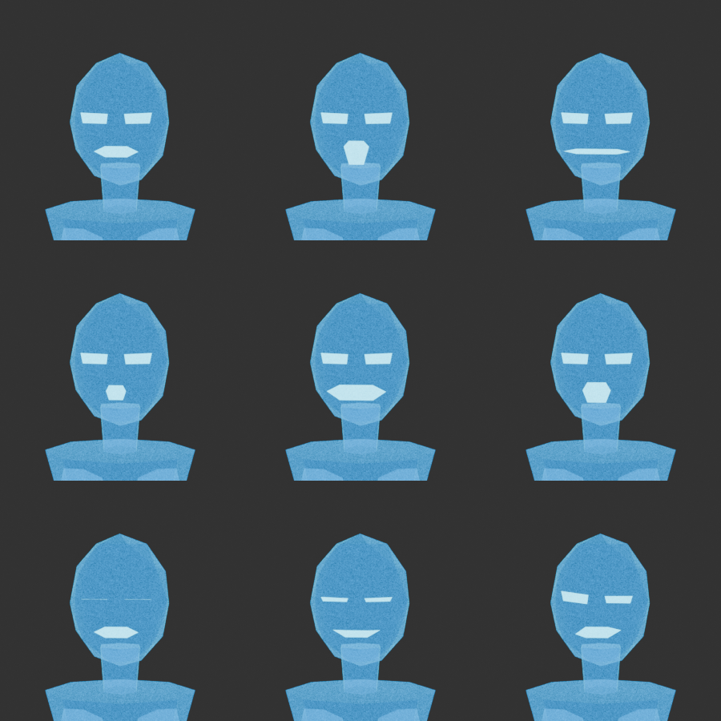

# Lumen Relay — low-poly voice avatar

Lumen Relay is an original, faceted holographic humanoid for a phone-first voice interface. Its silhouette uses 19 small rigid-skinned mesh pieces, while a translucent MToon material supplies the cyan emission and Fresnel rim. There are no image textures or borrowed character geometry.

## Runtime assets

| asset | purpose | size |
|---|---|---:|
| [`lumen-relay.vrm`](lumen-relay.vrm) | VRM 1.0, humanoid metadata, expressions, nine clips | 318,344 bytes |
| [`lumen-relay.glb`](lumen-relay.glb) | generic glTF runtime fallback with the same clips | 301,644 bytes |
| [`lumen-relay.blend`](lumen-relay.blend) | editable Blender source with rig, actions, materials, camera and lights | 270,507 bytes |

- Exported triangles: **520** in both runtime files; budget: 5,000.
- Meshes: 19; armature bones: 54; required VRM humanoid bones plus shoulders, eyes, fingers and toes are mapped.
- Texture count and total texture size: **0 textures, 0 bytes**.
- Proof render size: **360 × 640 px**, matching the intended portrait page slot. The expression sheet is 900 × 900 px.
- Material: transparent MToon base, cyan emission, 4.5-power parametric Fresnel rim, flat polygon normals.
- VRM permissions allow redistribution, modification, commercial use and every enumerated use category; `otherLicenseUrl` points to the repository MIT license.
- The VRM container’s standard `licenseUrl` identifies the VRM Public License 1.0; the repository MIT license is an explicit alternative grant recorded in `otherLicenseUrl` and `thirdPartyLicenses`. Either grant may be used, and `creditNotation` is `unnecessary`.

When playing the included raw-bone glTF clips through `@pixiv/three-vrm`, construct `VRMLoaderPlugin` with `{ autoUpdateHumanBones: false }`. This prevents normalized-bone auto-update from overwriting the animation mixer. [`verify.mjs`](verify.mjs) exercises mixer playback followed by `vrm.update()`, loop endpoints, the sit/stand boundary, frame-step limits, expression deformation/reset, the humanoid map and triangle count.

## Animation state names

The exported names are stable public identifiers. One-shot states hold their final frame; loop states return exactly to their first frame.

| exported action | duration | mode | state transition / use |
|---|---:|---|---|
| `sit` | 1.500 s | one-shot | standing neutral → seated rest; then hold or enter `stand_up` |
| `stand_up` | 1.500 s | one-shot | seated rest → standing neutral; starts exactly at `sit` end |
| `idle_breathing` | 1.500 s | loop | quiet standing default |
| `listen` | 1.500 s | loop | attentive head and chest motion |
| `talk_beats` | 1.333 s | loop | alternating conversational hand beats |
| `nod` | 1.333 s | loop | affirmative head beat |
| `shrug` | 1.333 s | loop | bilateral shoulder and hand gesture |
| `think` | 1.500 s | loop | hand-to-face reflective gesture |
| `rest` | 1.500 s | loop | compact low-energy standing state |

## Visemes and expressions

| shape key | VRM 1.0 expression | audio cue |
|---|---|---|
| `aa` | `aa` preset | A / open |
| `ih` | `ih` preset | I / wide-thin |
| `ou` | `ou` preset | U / rounded-small |
| `ee` | `ee` preset | E / wide-open |
| `oh` | `oh` preset | O / rounded-open |
| `blink` | `blink` preset | bilateral eyelid close |
| `neutral` | `neutral` preset | reset baseline |
| `amused` | `happy` preset and `amused` custom | softened eyes and smile |
| `puzzled` | `surprised` preset and `puzzled` custom | asymmetric eyes and mouth |

## Proof

- [Turntable GIF, 360 × 640](proof/turntable.gif)
- Pose stills: [sit](proof/sit.png), [stand up](proof/stand_up.png), [idle breathing](proof/idle_breathing.png), [listen](proof/listen.png), [talk beats](proof/talk_beats.png), [nod](proof/nod.png), [shrug](proof/shrug.png), [think](proof/think.png), [rest](proof/rest.png)

## Rebuild and verification

Run `./avatar/low-poly/build.sh` from the repository root. The build uses CPU-only Blender 5.0.1 in background mode, exports VRM and GLB, renders proofs, copies the moving animation accessors from the GLB into the VRM container, then loads both files through three.js and three-vrm. Software GL is used when the optional `gl` module exists; otherwise the verifier asserts the scene graph, mixer playback, animation continuity, expressions and structure.

The VRM Add-on export step emits static action accessors while it temporarily establishes the required humanoid T-pose. [`repair-vrm-animations.mjs`](repair-vrm-animations.mjs) replaces only those accessors with the matching, validated Blender glTF action data; all VRM 1.0 metadata remains from the add-on export.

## Sources and licenses

| source | role | license |
|---|---|---|
| [`generate.py`](generate.py) | original avatar geometry, weights, facial shapes, material and animation authored procedurally in this repository | MIT, repository [`LICENSE`](../../LICENSE) |
| [VRM Add-on for Blender v4.7.1](https://github.com/saturday06/VRM-Addon-for-Blender/releases/tag/v4.7.1), release SHA-256 `1fba87c3c6b2f995120f76c023bb11ab108b0a4a276872b4c10b20fae73e65ca` | standard humanoid armature, VRM 1.0 metadata and MToon export | MIT OR GPL-3.0-or-later |
| [Blender 5.0.1](https://www.blender.org/) | CPU-only modeling, animation, export and proof rendering tool | GPL-3.0-or-later |
| [Khronos glTF Blender I/O 5.0.21](https://github.com/KhronosGroup/glTF-Blender-IO) | GLB writer embedded in Blender and used by the VRM add-on | Apache-2.0 |
| [three.js 0.180.0](https://github.com/mrdoob/three.js/tree/r180) | headless glTF loading, mixer playback and structure validation | MIT |
| [@pixiv/three-vrm 3.4.2](https://github.com/pixiv/three-vrm/releases/tag/v3.4.2) | VRM 1.0 loading, humanoid and expression validation | MIT |
| [headless-gl 8.1.6](https://github.com/stackgl/headless-gl/tree/v8.1.6) | optional 64 × 64 software render; package and integrity are pinned in `package-lock.json` | BSD-2-Clause |
| [Node.js 22.22.0](https://nodejs.org/) and npm 10.9.4 | JavaScript build and verifier runtime | MIT and bundled third-party notices; Artistic-2.0 |
| [ImageMagick 7.1.2-13](https://imagemagick.org/) | proof GIF and expression-sheet assembly | ImageMagick License |
| [curl 8.18.0](https://curl.se/) and [Info-ZIP unzip 6.0](https://infozip.sourceforge.net/) | add-on download and extraction | curl License; Info-ZIP License |
| [nixpkgs revision `71caefc`](https://github.com/NixOS/nixpkgs/tree/71caefce12ba78d84fe618cf61644dce01cf3a96) | hashed package set pin for all build tools in [`shell.nix`](shell.nix) | MIT |

No external mesh, character, texture, scan or likeness is used. Generated `.blend`, `.vrm`, `.glb`, PNG and GIF artifacts are distributed under the repository MIT license.
