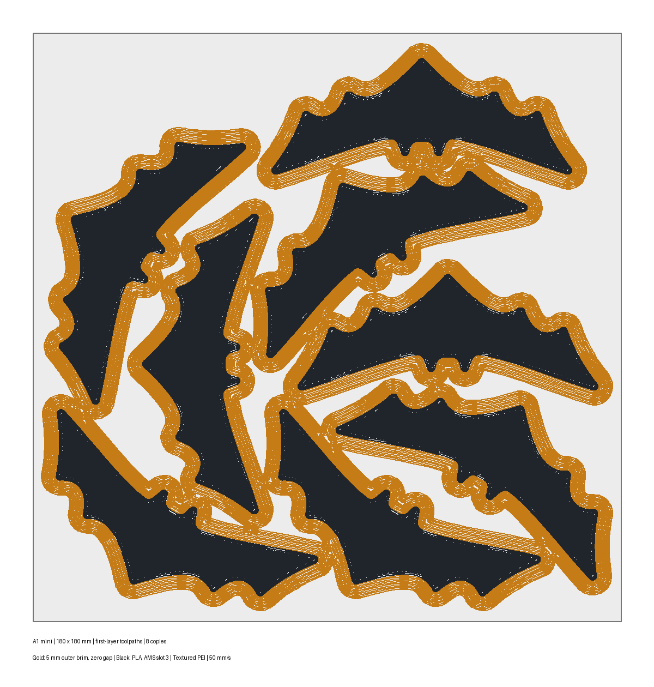

# Small batarang

## Design

One symmetric, solid OpenSCAD body, approximately 95 mm across and exactly 4 mm thick. A scalloped lower wing and two short ears make the silhouette recognizable. A 1.2 mm opening radius softens convex tips; a 2.2 mm closing radius leaves at least 1.2 mm at concave corners after the 1 mm outward bevel. A circular 1 mm Minkowski chamfer rounds the vertical perimeter and bevels both faces. The wide bottom face sits at Z=0 and the lower bevel grows at 45°, so the plate needs no supports. There are no separate parts or assembly dependencies.

This is a handheld decorative prop, not a throwing toy. Print flat in PLA with a 0.4 mm nozzle and 0.20 mm layers. The prepared eight-copy plate uses a continuous outer brim for adhesion.

`../build` generates the STL and preview of the single part and of `plate`, eight copies laid out for one A1 mini bed with at least 5 mm between parts and from the edge; the layout is the `layout` list in the source. `./render.sh` produces a 1200 × 900 still and a short 800 × 600 turntable using the same OpenSCAD/FFmpeg path as the horn project. `./slice-a1-mini.sh` replaces the packed plate through the horn project's native OrcaSlicer A1 mini profile-loading path, with supports disabled. Run it with `nix-shell -p orca-slicer jq xvfb-run --run "bash batarang/slice-a1-mini.sh"` from the repository root.

## Prepared plate

The exported solid measures 93.75 × 37.47 × 4.00 mm. `batarang-a1-mini.gcode.3mf` contains a single centered part for the A1 mini, 0.4 mm nozzle, Generic PLA, 0.20 mm layers, textured PEI, no supports and no brim. OrcaSlicer estimates **4.46 g**, **9 min 0 sec model time**, and **14 min 35 sec total** including startup. These are estimates, not a completed print. `batarang-a1-mini-plate.gcode.3mf` replaces the previous packed plate in place, retaining all eight copies and their geometry and positions. It uses **5 mm outer brims**, **zero brim-object gap**, **Textured PEI Plate**, and **black Generic PLA in AMS slot 3** (`T2` / `M620 S2A`). Both first-layer perimeter and infill use the profile's slow **50 mm/s** speed. Adjacent brims merge in the narrow spaces; all eight retain continuous perimeter contact. The outermost extrusion remains more than 2 mm inside the bed. The header estimates **37.30 g**, **1 h 17 min 11 sec model time**, and **1 h 23 min 29 sec total**.

The packaged G-code configuration header records:

```text
; brim_object_gap = 0
; brim_type = outer_only
; brim_width = 5
; curr_bed_type = Textured PEI Plate
; filament_colour = #000000;#000000;#000000
; filament_type = PLA;PLA;PLA
; initial_layer_infill_speed = 50
; initial_layer_speed = 50
; filament used [g] = 0.00, 0.00, 37.30
```

`plate.png` shows the packaged first-layer extrusion paths: gold brims and black model paths. `verify.py` regenerates this preview, including fitted arcs.



The headless slicer cannot generate its embedded thumbnail; use `still.png`, `above.png`, `plate.png` and `turntable.gif` for previews.

Independent critics scored the still **9, 9 and 8.4 out of 10**, all passing the 8 threshold; see [round 1](proofs/critic-1.md), [round 2](proofs/critic-2.md) and [round 3](proofs/critic-3.md). Round 2 enlarged the concave radii left after beveling and is the retained geometry; round 3 re-judged it and flagged the wingtips as the thinnest safety margin. The retained candidate has rounded wing tips, ears, scallops, and tail plus continuous 1 mm face chamfers. Printed surfaces may still need deburring.

`verify.py` checks watertightness, a single solid, dimensions, mirror symmetry, broad first-layer contact, and both packages' printer/material/layer/support/brim settings; for the plate it also checks that every copy is flat and identical to the single, the 5 mm clearances, bed bounds, continuous brim contact around each first-layer perimeter, first-layer speed, and tool T2 selection. The single-part package retains its original settings. Its dependency command is recorded in `../test-map.json`.
