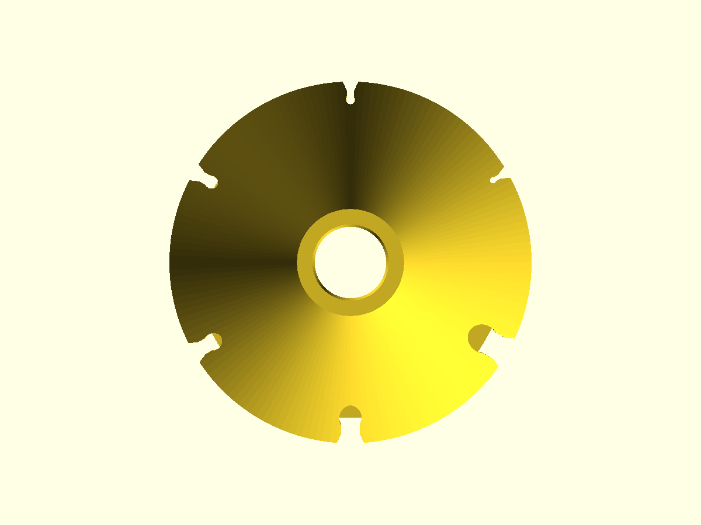
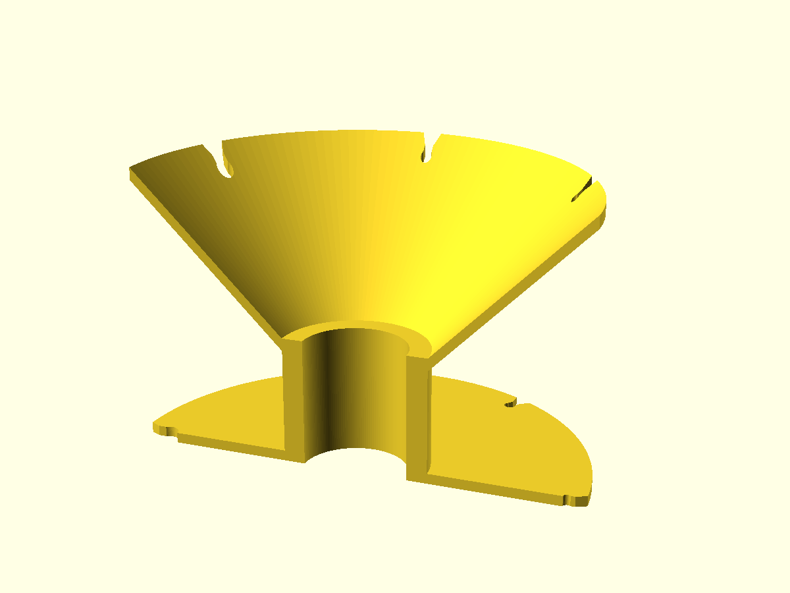

# Cable spool

One-piece spool for a cable of any length and thickness: a hollow core between a flat bottom flange and a 45° conical top flange, so the whole part prints upright with no supports. Each flange carries six keyhole slots, 2, 3, 4.5, 6, 8 and 10 mm, each a round pocket behind a neck 0.4 to 1.2 mm narrower than the cable: push a cable end through the neck and the pocket holds it. Wind from one flange's slot, finish in the other's.

| top flange, face-on | section |
|---|---|
|  |  |

130 mm across, 81 mm tall, 30 mm bore. Slot sizes, flange radius, core and gap are the parameters at the top of [cable-spool.scad](cable-spool.scad).

[cable-spool.gcode.3mf](cable-spool.gcode.3mf) is sliced for a Bambu Lab A1 mini (0.4 mm nozzle, 0.20 mm Standard, PLA, 3 walls, 15% infill, supports off): 94 g, 2 h 42 min. The slice contains no support and no overhang wall; every wall and surface rests on the line below it apart from sub-millimetre slot corners, and the only bridges are internal skins over sparse infill.
