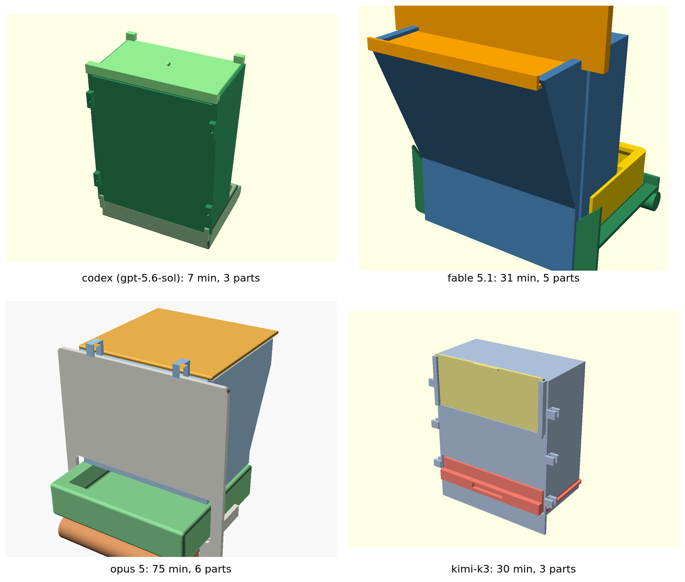

# Conure feeder hopper

A parametric OpenSCAD seed hopper for a green-cheek conure feeder: wedge (plane-flow) body that fills a 140 × 170 mm cage door opening, about 1 litre, refilled from outside, hull-lipped tray with a perch below, printable on a Bambu Lab A1 mini in PETG without clogging on dried banana slices. Full brief: [spec.md](spec.md).

The same spec was handed to several models with no workflow or tools prescribed. Each lane directory is one model's complete, unedited answer: its `hopper.scad`, its `REPORT.md` (approach, dead ends, dimensions, and the verification it actually ran), its verification and render scripts, and its renders. STLs are not checked in; each is one `openscad` call away.



| lane | model | wall | parts | source | report |
|---|---|---|---|---|---|
| [codex/](codex) | gpt-5.6-sol | 7 min | 3 | [hopper.scad](codex/hopper.scad) | [REPORT.md](codex/REPORT.md) |
| [fable/](fable) | claude-fable-5-1 | 31 min | 5 | [hopper.scad](fable/hopper.scad) | [REPORT.md](fable/REPORT.md) |
| [opus/](opus) | claude-opus-5 | 75 min | 6 | [hopper.scad](opus/src/hopper.scad) | [REPORT.md](opus/REPORT.md) |
| [kimi/](kimi) | kimi-k3 | 30 min | 3 | [hopper.scad](kimi/hopper.scad) | [REPORT.md](kimi/REPORT.md) |

The side-by-side table and how each model checked its own work: [comparison.md](comparison.md).

## Rendering

Every lane's `hopper.scad` selects what to export through the top-level `part` variable (`"assembly"` by default; the per-part names are the `part==` cases in each file). For example:

```sh
openscad -D 'part="lid"' -o lid.stl hopper.scad
```

Lane-specific:

- **codex**: `codex/validate.py` checks the exported STLs (trimesh).
- **fable**: `fable/render.sh` exports every STL, `fable/render_png.sh` renders the PNGs under xvfb, `fable/verify2.py` runs the mesh checks, `fable/slice.sh` with `fable/slicer.ini` is the PrusaSlicer dry-run.
- **opus**: source in `opus/src/`, renders in `opus/img/`, mesh checks in `opus/ver/verify.py` and `opus/ver/check.py`.
- **kimi**: `kimi/build_stl.sh` exports the STLs, `kimi/verify_mesh.py` and `kimi/verify2.py` run the mesh checks, `kimi/render.py` draws its PNGs with matplotlib (its sandbox had no OpenGL, so `kimi/build_png.sh` never ran). `kimi/img_assembly_*.png` are the same source rendered with OpenSCAD by `montage.sh`.

`montage.sh` renders the kimi panel and composes `montage.png` from one assembly render per lane (needs `openscad`, `xvfb-run`, `imagemagick`, DejaVu fonts).

Tools used by the lanes, all from nixpkgs: `openscad`, `python3` with `trimesh`, `manifold3d`, `shapely`, `matplotlib`, `prusa-slicer`, `xvfb-run`.

## License

MIT, see [LICENSE](../LICENSE).
