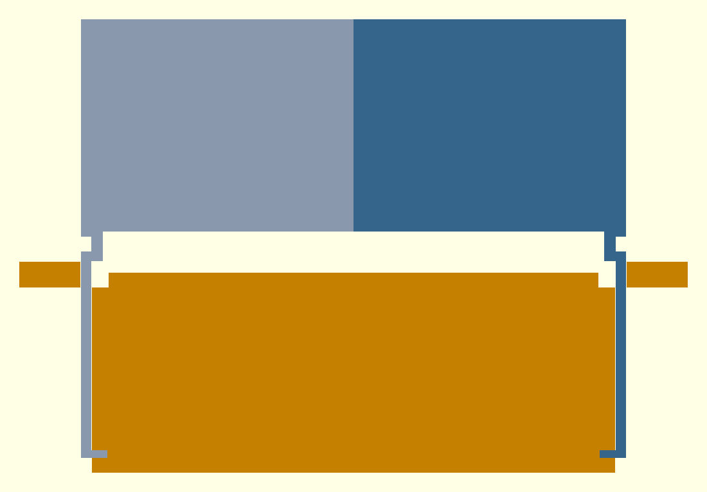
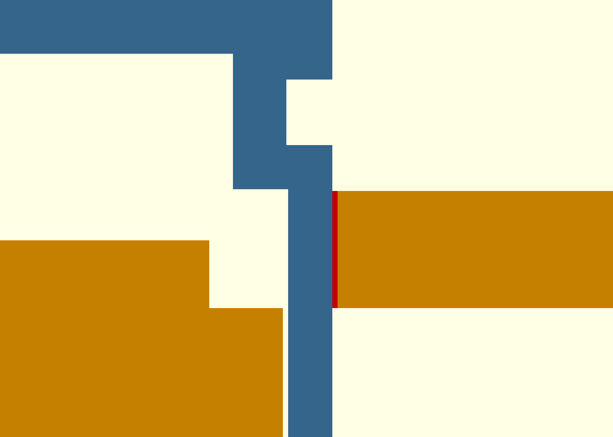
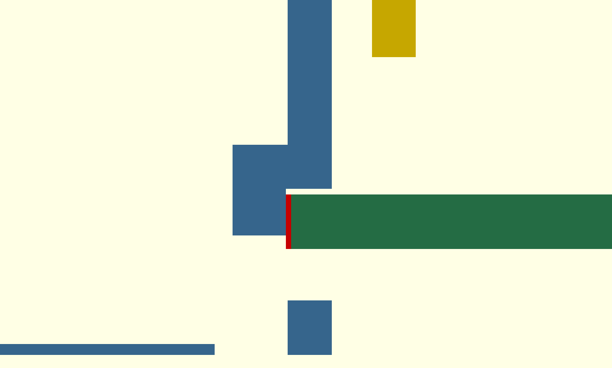
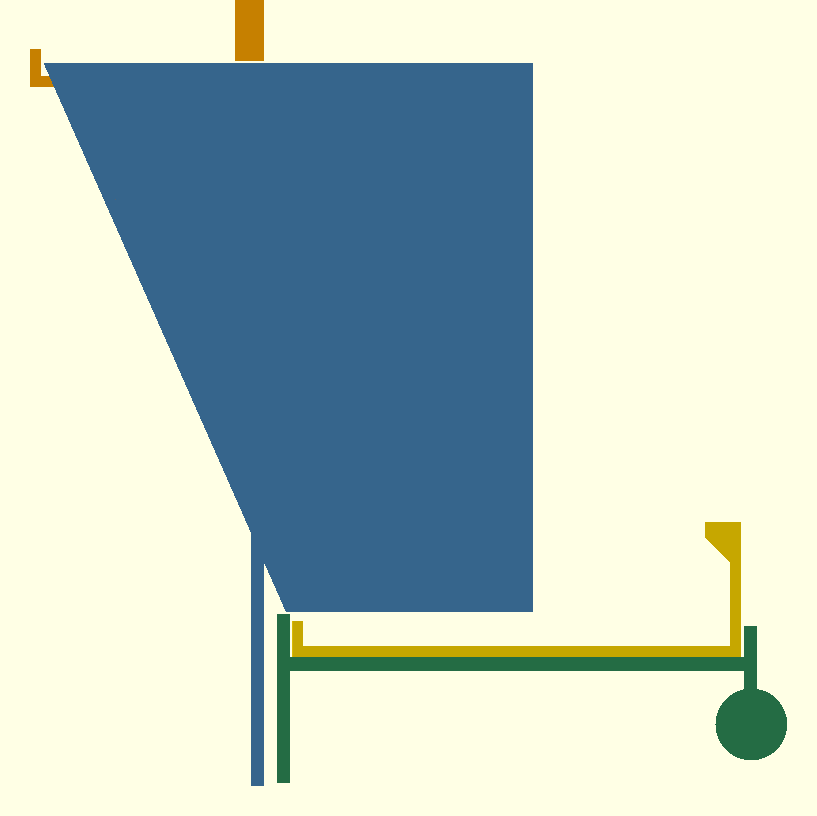
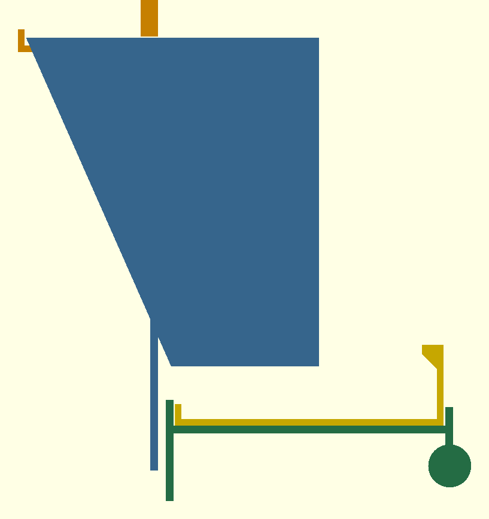
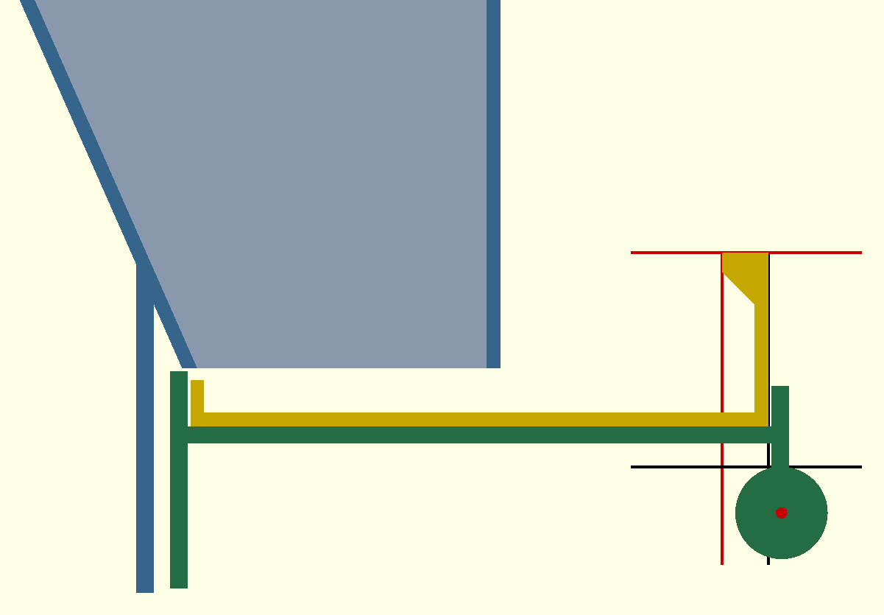
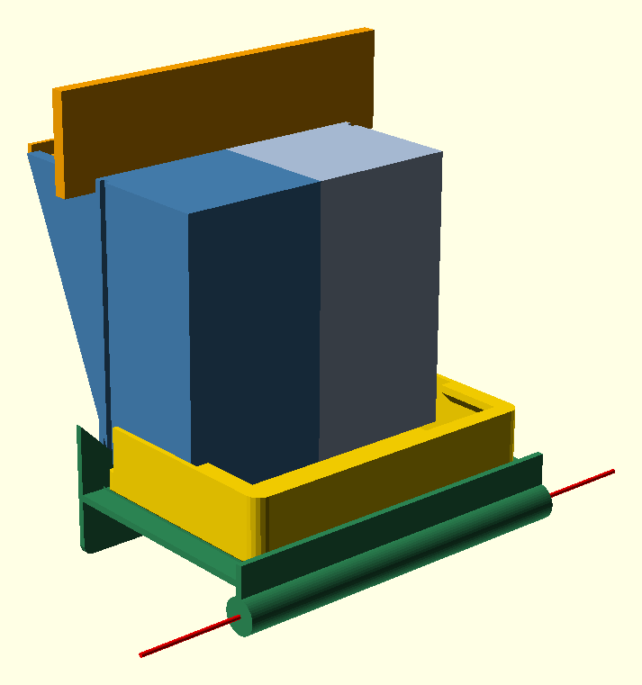
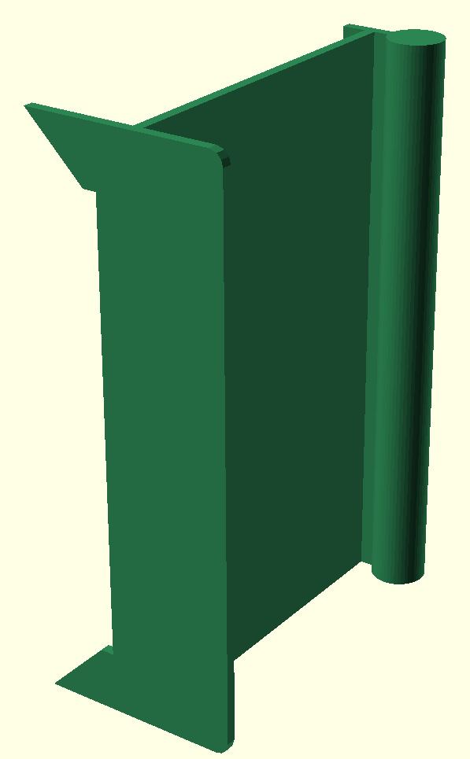

# Comparison

Four lanes delivered (codex, fable, opus, kimi). Kimi's own renders are matplotlib mesh plots (its sandbox had no OpenGL); its `out/` previews are its `hopper.scad` rendered with OpenSCAD like the others.

**Nobody chose FreeCAD, screenshots, or a GUI.** Every model went OpenSCAD source → STL → a Python mesh check, and rendered with OpenSCAD under xvfb or with matplotlib. A prescribed FreeCAD-by-screenshot loop, tried earlier, was strictly worse than what each model reached on its own.

| | codex (gpt-5.6-sol) | fable 5.1 | opus 5 | kimi-k3 |
|---|---|---|---|---|
| time | 7 min | 31 min | 75 min | 30 min |
| parts | 3 (body, lid, tray+perch) | 5 (2 mirror body halves, lid, bracket, tray) | 6 (mount plate, 2 shells, lid, tray, perch) | 3 (body = door plate + bin + bar clips, lid, tray+perch) |
| tools | OpenSCAD, trimesh, PrusaSlicer 2.9.4, Xvfb | OpenSCAD, trimesh+manifold3d, PrusaSlicer | OpenSCAD, trimesh+manifold3d, xvfb/llvmpipe | OpenSCAD, trimesh+numpy, matplotlib (no GL in its sandbox) |
| watertight | 3/3 (trimesh) | 5/5 + Euler 2, 0 internal faces | 6/6 (+ mount Euler −2 explained: 2 holes) | 4/4 (body, lid, tray, cavity solid; trimesh, Euler −2 body/tray from rail and ledge channels) |
| capacity | 1.04 L (analytic polygon×width) | 1.145 L (boolean cavity, matches analytic 1.147) | 1.065 L (seed-column solid exported and measured) | 1.030 L (cavity solid exported and measured: 132×60×130 box) |
| slot | 130×54 | 50.2 (section at z=0.5) | 118×70 (sections at 3 heights) | 132×60, the whole open bottom of the bin (section at cavity floor) |
| wall angle | 75.4° (from source dims) | 66.2° (every upward interior face measured) | 65° (min over every downward cavity normal) | 90° (8 cavity faces all vertical; a straight chute, the wedge limit — 3 sloped variants abandoned as unable to hold 1 L) |
| wall ≥2.4 | **by arithmetic only** (nominal 3.0, oblique 2.83 computed by hand, not from mesh) | inward ray-march 8000 samples/part; sub-2.4 hits itemised (acute cuts, 1.2 mm rails) | 60k-sample ray-march; caveat: 6% of tray, ~1% of shell samples <2.4 at tangency seams, not all inspected | 9 point ray probes, one per wall, all 3.0–5.0; a 60k-sample ray-march of the STLs finds 2.0 mm at the clip webs, lid rails, lid grip ridge and tray-tab web (2 mm in the source), 0.6–0.8% of samples per part |
| fit 140×170 / 12 mm bars | flange exactly 140×170, dimensional | bar-plane section 134.8×117; every bearing ≥1 bar pitch | plate 156×162 overlaps 8 mm/side; hooks 7 mm between bars; modelled cage render | plate 138×168 (1 mm clearance); 6 clips assume vertical Ø3 bars at X −6 and 144 — stated unverified against a real cage |
| assembly clash | not checked | 10 pairwise booleans, all 0 mm³ | pairwise, pass | not checked; pairwise booleans on the shipped transforms: tray side walls run 8 mm into the bin's outer wall (144 mm³, the tray cannot slide in as modelled), lid sits 1 mm into its sill (384 mm³) |
| printability | PrusaSlicer dry-run: sliced, **long-bridge warnings → recommends supports** | PrusaSlicer dry-run, supports OFF, all 5 clean; per-part overhang audit | no slicer; overhang % per part (≤0.6%, tray 4.3%) | no slicer; per-face down-facing area in the print orientation: body needs one 7,500 mm² support region under the bin's outer wall, tray 930 mm² under the perch, lid none |
| layer lines along flow | body upright (claimed) | halves printed end-wall-down | shells split on midplane, side-wall-down (also zero-overhang walls) | body printed on its side (part X vertical), walls vertical so every flow wall is a layer plane |
| self-caught defects | none reported | back wall 1.6 mm mid-run, 3 clashes, U-arm ceiling redesign | orientation/split problem (35 min), 7 CGAL-manifold fixes | non-manifold tangent unions (added 1 mm overlaps), tangent perch cylinder, lid drawn flat in the first render |
| stated gaps | no physical print/flow; supports needed; wall by calc not mesh | square-cut body/lid edges, no lid detent, butt seam | tray runs brim-full (0.6 mm discharge gap), no slicer, perch load unanalysed | no slicer; cage-bar fit unverified; open-bottom bin drains into the cage when the tray is out; tray/bin interference not found |

## How each checked its work

- **codex**: one `validate.py` (trimesh watertight + bbox) plus arithmetic from the source parameters for capacity, slot, angle, walls; then a real PrusaSlicer dry-run per part. Cheapest and fastest, but the wall-thickness and angle "checks" are restatements of the inputs, not measurements of the output. The slicer run was the one check that actually pushed back (bridges), and it reported that honestly.
- **fable**: every requirement measured on the final STL, not the source: ray-march thickness with an edge-proximity filter, boolean cavity volume vs analytic, sections for slot and bar-plane fit, interior-face angle census, pairwise assembly booleans, overhang audit in the shipped print orientation, then a supports-off slicer run. Iterated: the checks found a 1.6 mm wall and three clashes and it fixed them.
- **kimi**: verify_mesh.py (trimesh watertight, bbox, volume, Euler) and verify2.py: nine single-ray thickness probes at hand-picked points, cavity-solid volume for capacity, cavity face normals for the wall angle, vertex extents for fit, and per-face down-facing area for supports. Measures the STL, but only where it chose to look: one probe per wall misses the 2 mm clip webs and rails, and no assembly check means the tray-into-bin interference shipped. It did catch and fix non-manifold unions. Honest about the no-slicer, no-cage-fit gaps; the 90° "wedge" reads the spec's 60° minimum as satisfied by vertical walls.
- **opus**: same measurement-first stance with the largest sample counts, plus an exported seed-volume solid and a modelled cage for fit; no slicer. Most explicit about what it did NOT prove (tangency-seam samples, brim-full tray, no beak model). Spent the most time, most of it on the print-orientation/part-split problem.

Ranking by verification rigour: fable ≈ opus > kimi > codex. By time: codex ≪ kimi ≈ fable < opus. Codex's 7-minute design is the one most likely to need a redesign after the first print (supports, unmeasured walls); fable's is the one that sliced clean support-free with measured walls; kimi's needs a tray or bin cut before it assembles at all.

## Hands-on

Report (verbatim):

> ok, think is see how fables submission is supposed to ffit together, the lid holds the two halves together. still, it barely holds together.
> the butt join doesn't force alignment
> the bottom parts don't actuallly attach to the hopper, just expected to be held there by the bottom of the cage door i suppose.
> the perch is directly under the edge of the feeder bowl
> the perch points down, only usable by inverse-gravity conures
> 
> please add my roast to the contest analysis

What the geometry does on each point, measured on the committed STLs in `fable/out/` ([hands-on/measure.py](hands-on/measure.py) → [measure.json](hands-on/measure.json); renders by [hands-on/render.py](hands-on/render.py) from [hands-on.scad](hands-on/hands-on.scad), which imports those STLs; X across the door, Y into the cage, Z up, outlet at Z = 0).

**1. What holds the halves together, and the seam's play.** The seam is a bare plane: body_R ends at X = 0 and body_L starts there, the mating face is 917 mm² of coplanar triangles, and no feature of either half crosses X = 0. Three parts span the seam; the tray touches neither half at any shift tested, so the lid and the bracket are the joint. The lid's outer headboard blocks sit 0.3 mm off the body's end faces (67.4 vs 67.7) and the bracket's window edge 0.3 mm off the groove floor (64.9 vs 65.2): body_L shifted 0.3 mm outward, forward or back intersects nothing, 0.4 mm hits the lid or the bracket. So each half has 0.3 mm of play in X and in Y, a seam gap of up to 0.6 mm. The lid plate (Z 117–119.4) rides between ledges whose faces are at 116.7 and 120, so the halves can also shear 0.9 mm vertically against each other. **Stands.**

| plan slab Z 118–121 | right corner, same slab: red = the 0.3 mm between body end face and lid block | right corner, slab Z 0–3: red = the 0.3 mm between groove floor and window edge |
|---|---|---|
|  |  |  |

**2. What retains the bracket and tray.** The bracket's window edge sits in the body's end-wall groove, and the plate material inside the groove's footprint reaches only Z = 5.7. Sliding the bracket down 0.5, 2, 6 or 12 mm intersects nothing on the body halves or the lid (0 mm³ at every step), so it is free to fall, and past 5.7 mm it is out of the groove and free in every direction; sliding it up 0.4 mm clears and 0.6 mm hits the body (window sill against the back wall's bottom edge). The grooves locate the bracket in X and let it fall. Its plate starts at Y = 0.3; the body's cage-side bearing face, the flange, ends at Y = −2.5, so nothing the body bears on can also bear the bracket. The tray is captive: it sits on the shelf behind a ridge that rises to Z = −3, 7 mm above the shelf (sliding the tray 1 mm toward the cage hits the ridge, 472 mm³), and lifting it hits the body (73 mm³ per half at 3 mm, 164 mm³ per half at 7 mm), so with the body in place the tray cannot come out. The lid slides outward 1, 5 or 20 mm through nothing. **Stands.** The bracket and tray hang on nothing in the model; off the cage the assembly is held by the lid's friction alone.

| section at X = 66, through the groove | bracket and tray lowered 12 mm: out of the groove, touching nothing |
|---|---|
|  |  |

**3. Perch versus the tray lip.** Circle fit through the 94 rim vertices of the perch cylinder: axis at Y = 106.05, Z = −25.0, radius 8.0. Tray front wall outer face Y = 103.8, lip tip Y = 95.8, lip top Z = 20 (section at X = 30). The perch axis is 2.25 mm in front of the tray's front wall and 10.25 mm in front of the lip's tip, 45 mm below the lip top; the perch's top is 37 mm below the lip top, and 5.75 mm of its 16 mm diameter lies under the tray's footprint. **Stands.** The perch straddles the tray's front edge, a third of it under the tray.

**4. Perch axis direction.** Principal axis of the same rim vertices: (1, 0, 0), 0.0° from horizontal, spanning X = −82.7 to 82.7, the bracket's full width: horizontal along the cage wall. In the bracket's print orientation (on its X end, REPORT.md) the same rod is vertical, and by point 2 nothing in the model holds the loose bracket in any other attitude. **Does not stand for the assembled geometry; stands for the part as printed.**

| perch axis in the assembly (red) | bracket in its print orientation |
|---|---|
|  |  |
