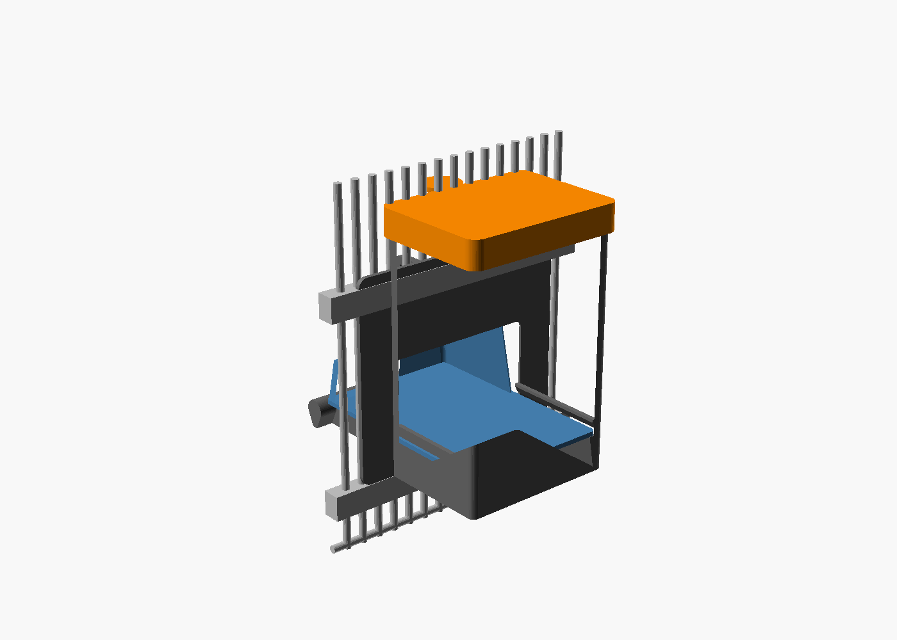
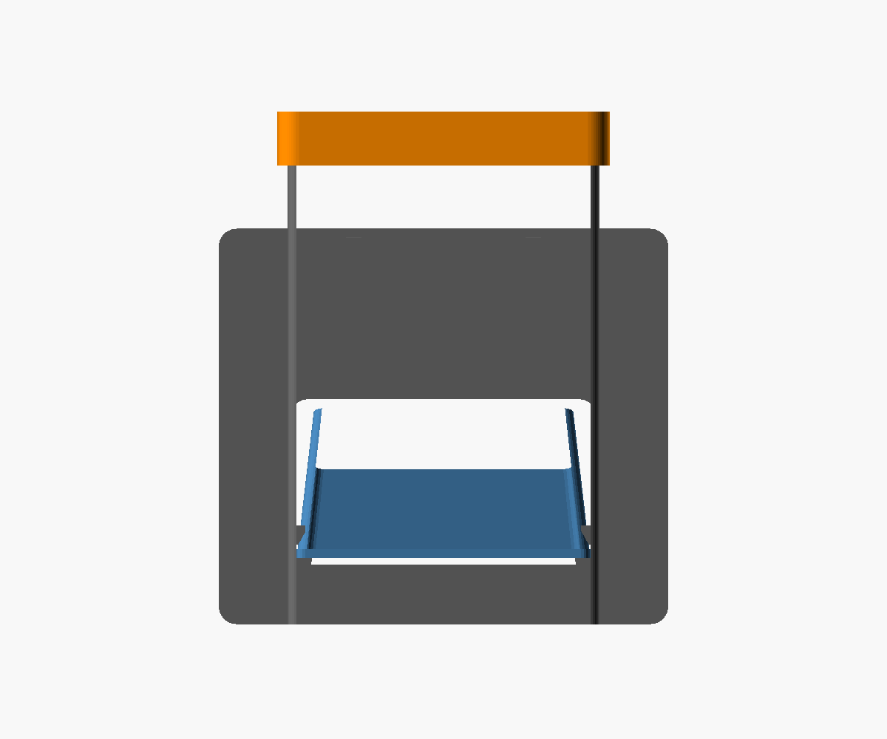
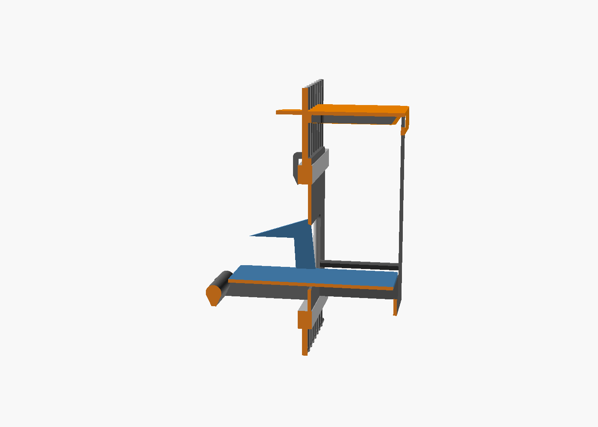
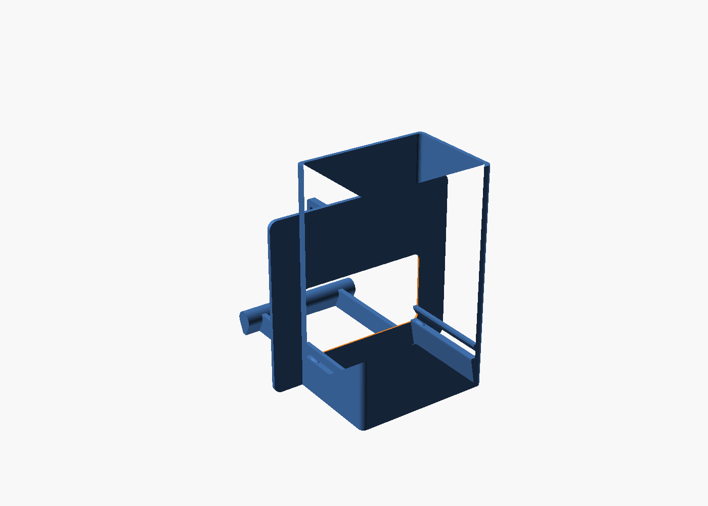
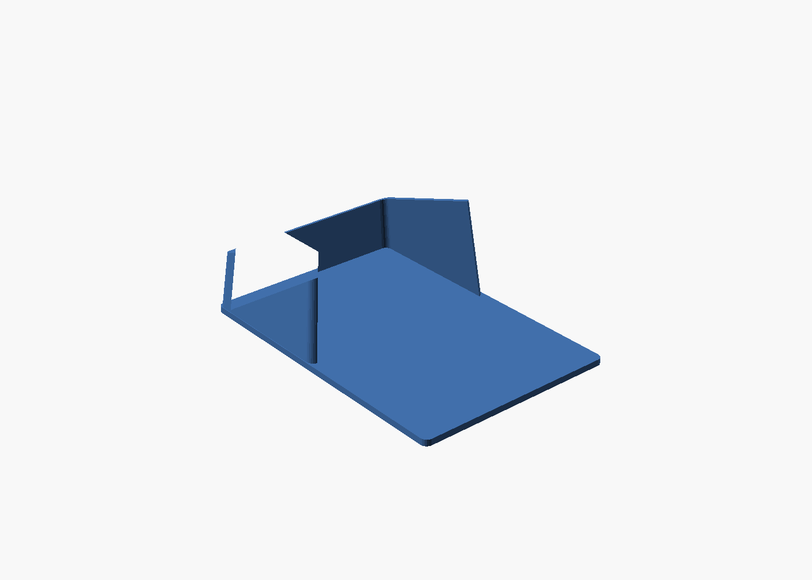
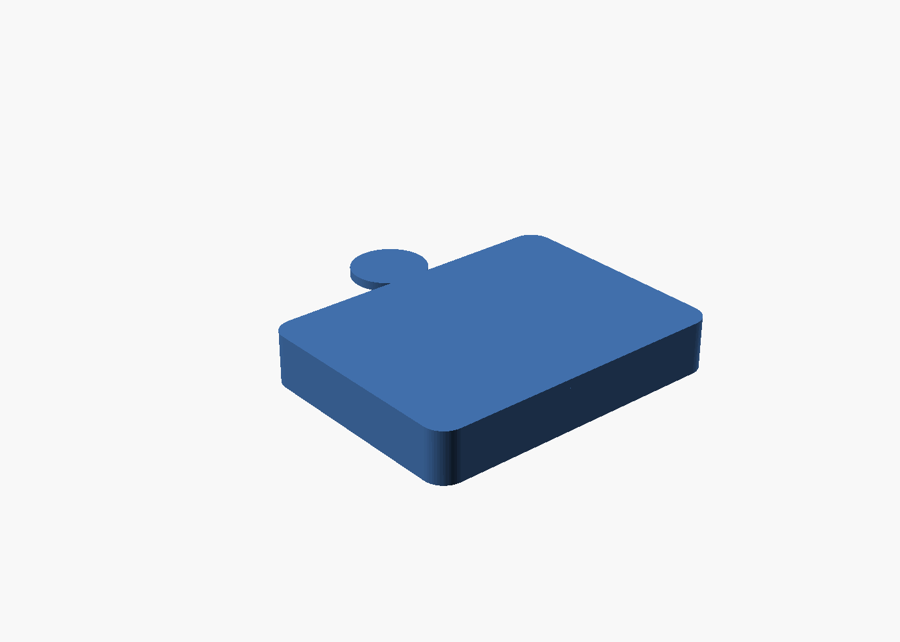
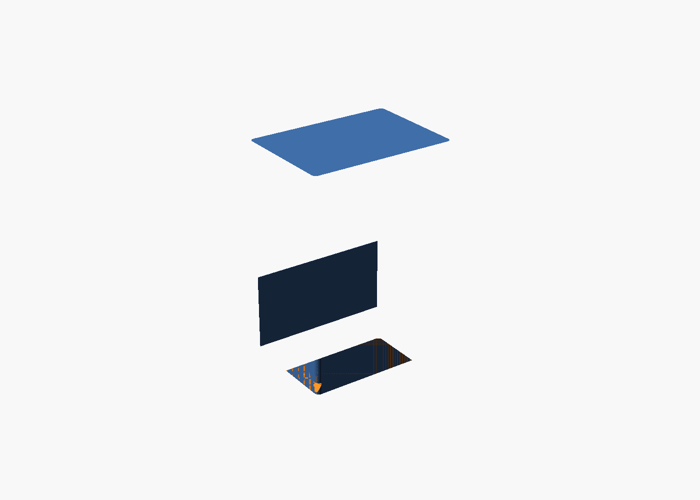

run-id: A1

# Parametric seed hopper for a green-cheek conure — small feeder door, Bambu A1 mini, PETG

Three printed parts. The reservoir hangs outside the cage; only the feed tray, the
perch and the hook cross the door opening.



## (a) Approach and tools, and why

**Requirement in one sentence:** a ~1 L reservoir that seats in a 110 x 110 feeder
door, refills from outside, and delivers a sticky seed/banana mix through a full-width
slot into a removable tray with a perch, in parts no larger than 175 mm.

**The dumbest design that satisfies it, and the one I built.** A wedge hopper converges
in one plane. Convergence is what makes a hopper arch. The spec already forbids a
converging funnel and demands a slot at least 2 x the banana-slice diameter, so I
removed the convergence entirely: the reservoir is a straight vertical prism, 98 x 70 mm
in plan, open at the bottom. Its walls are therefore at 90 degrees from horizontal, its
narrowest internal cross-section equals its outlet, and there is no inclined surface
anywhere for a sticky slice to rest on. Flow is stopped not by a restriction but
downstream, by the seed pile in the tray sealing the outlet, which is how a gravity
feeder is supposed to work. Deleting the convergence also deleted every internal
overhang and every support requirement in the reservoir.

**Mounting.** No latch, no toggle, no fastener. The front plate is 150 mm wide, wider
than the 110 mm opening, so the unit cannot pass inwards. Two hook fins at the top wrap
the door's top rail from outside, so it cannot pass outwards or fall. The load is ~0.8 kg
and hangs outboard, so gravity presses the plate against the bars. Releasing it means
lifting the whole loaded hopper about 15 mm and pulling. A 70 g conure cannot.

**Tools.** OpenSCAD 2021.01 for the model, because the deliverable asks for a
parametric `hopper.scad` with a `part` selector and because CSG makes the verification
gauges below trivial to express. NumPy for mesh checks I wrote myself (`check.py`,
`thickness.py`, `overhang.py`) rather than trusting a black box: an STL parser, an
edge-pairing watertightness test, a divergence-theorem volume, a ray-cast wall-thickness
scanner and a facet-angle overhang scanner. PrusaSlicer CLI for the slicing dry-run.
All from `nix-shell -p`; nothing installed.

**The verification idea worth naming:** most geometric requirements are stated as "X
must fit through Y" or "nothing may intrude into Z". Those are boolean questions, so I
expressed each as a CSG gauge part whose render must be empty or zero-volume, and let
OpenSCAD's exact CGAL kernel answer them. `check_width`, `check_fit_low`, `check_slot`,
`check_flow`, `check_clash_lid`, `check_tray_travel` are all of this kind. That is
stronger than eyeballing a render and stronger than comparing my own numbers to my own
numbers.

## (b) What I actually did, including dead ends

1. Sized the reservoir. 98 x 70 x 143 mm gives 0.98 L in a part under 175 mm.
2. **Dead end: a converging wedge.** I first laid out a proper asymmetric wedge, one
   vertical wall and one at 60 degrees, converging to a 55 mm slot. With a 90 mm deep
   reservoir the 60-degree wall drops 156 mm before it reaches the slot, which blows
   the height budget, and printed upright it is the one stair-stepped surface in the
   model, in exactly the place a sticky slice would catch. Discarded in favour of zero
   convergence.
3. **Dead end: outlet in the floor.** A bottom outlet dumps seed until the pile seals
   it from below, and the pile spreads in all directions: a 98 x 70 outlet 28 mm above
   the tray floor needs a tray about 195 mm wide. Moved the outlet to a full-width
   vertical window facing the cage, so the pile only has to build in one direction.
4. **Dead end: tray walls 50 mm tall at the outlet.** The pile has to reach the top of
   the slot to seal it, so the tray wall next to the slot must be about as tall as the
   slot. At 50 mm above the tray floor the tray no longer passes through its own window.
   Fixed by sloping the tray rim: 48.5 mm above the floor at the reservoir end, 25 mm
   at the bird's end. It seals at the outlet, and the bird reaches over a low front rim.
5. **Dead end: a stepped, rolled hull lip.** I built the tray's inward-turning rim as
   eight bands each shifted 0.3 mm inward over 0.6 mm of rise. Geometrically fine, 27
   degrees from vertical. The slicer dry-run disagreed: each 0.3 mm tread is a
   near-horizontal facet, and PrusaSlicer's auto-support put 10 cm3 of support inside
   the tray. Replaced with a single tapered extrusion, a smooth tumblehome that leans
   the wall 6 mm inward over its height. Auto-support on the tray went to exactly zero.
6. **Dead end: a rotating toggle bar to lock the unit in.** A 150 mm bar on a vertical
   shaft, turned by a knob outside the cage, genuinely bird-proof. It is also a second
   moving part, a snap-fit shaft and an assembly step, to solve a problem that a wider
   plate plus gravity already solves. Deleted before it was modelled.
7. Ran the slicer dry-run, found auto-support under the tray-support ledges (a 45-degree
   gusset, exactly at PrusaSlicer's threshold) and under the tray retaining lip.
   Steepened the ledge to a rib that runs to the bed and the lip underside to 61
   degrees, and tapered the hook fin's lower leg. Body auto-support fell from 16.4 to
   12.2 cm3, all of the remainder attributable to the slot lintel bridge.
8. Wrote the gauge parts and the mesh checkers, iterated until every gauge passed.

## (c) Final dimensions, part list, capacity

Coordinates: X across the door, Y positive outwards from the cage (cage interior is
Y < 0), Z up from the bottom edge of the opening. The bar wall sits at Y = -2.5..+2.5.

| Part | STL | bounding box X x Y x Z (mm) | solid volume |
|---|---|---|---|
| body (reservoir + front plate + hook + perch) | `body.stl` | 150.0 x 166.5 x 168.0 | 218.9 cm3 |
| tray (removable, tumblehome lip) | `tray.stl` | 98.0 x 142.1 x 50.1 | 61.8 cm3 |
| lid | `lid.stl` | 110.8 x 106.4 x 18.0 | 45.3 cm3 |

Largest dimension anywhere: 168.0 mm, against the 175 mm limit.

Key dimensions:

| | mm |
|---|---|
| reservoir internal cross-section (constant, no convergence) | 98 x 70 |
| reservoir internal height above the tray floor | 143 |
| outlet slot, full width x height | 98 x 50 |
| reservoir wall angle from horizontal | 90 |
| front plate | 150 wide x 132 tall x 3 |
| door opening it seats in | 110 x 110 |
| tray floor above the opening's bottom edge | 25 |
| tray rim above the tray floor, reservoir end / bird end | 48.5 / 25 |
| perch: full-width rail, 14 dia bulb on a 4 stem, top at Z | 19 |
| perch position, inside the cage / forward of the tray rim | 80 / 13 |
| wall thickness everywhere structural | 3.00 (tray upper wall tapers to 2.64) |
| top-rail hook: rail slot | 13.5 deep x 17 tall (parameters `rail_t`, `rail_h`) |

**Capacity.** Reservoir 0.978 L, measured from the mesh, not from my arithmetic (see
verification 4). The tray holds a further ~0.19 L of working pile when the slot has
sealed, so a full fill is about 1.17 L of mix. At roughly 0.65 kg/L that is about 640 g
in the reservoir alone, far more than ten days for one green-cheek.

**How it works.** Lift the lid, which is entirely outside the cage and out of the
bird's reach, and pour. Seed falls down the prism onto the tray floor and out through
the 98 x 50 slot until the pile in the tray reaches the top of the slot and stops it.
The bird stands on the perch, 80 mm inside the cage and 13 mm forward of the tray, and
eats over a 25 mm rim. As it eats, the pile subsides and more seed flows. To clean, open
the cage door, lift the tray 1.2 mm over two detents and draw it out towards you.




## (d) VERIFICATION

Everything below is reproducible: `bash verify.sh` regenerates every STL from
`hopper.scad` and re-runs every check. The full captured output is `verify.log`; the
excerpts here are copied from it verbatim.

### Method

Boolean requirements are posed as CSG gauge parts. `crossing()` is the intersection of
body and tray with the half-space Y < 2.5, i.e. everything that reaches the cage side of
the bars. A gauge that must contain nothing renders empty, and OpenSCAD says so.

### 1. Mesh validity

`check.py` parses the STL, snaps vertices to 1 micron, and requires every undirected
edge to be used exactly twice and every directed edge exactly once. That is
watertight, manifold and consistently oriented in one test.

```
== body.stl
   facets 1808  vertices 900
   edges used != 2 times: 0   directed edges != 1 time: 0   -> WATERTIGHT+MANIFOLD+ORIENTED
== tray.stl
   facets 388  vertices 196
   edges used != 2 times: 0   directed edges != 1 time: 0   -> WATERTIGHT+MANIFOLD+ORIENTED
== lid.stl
   facets 676  vertices 340
   edges used != 2 times: 0   directed edges != 1 time: 0   -> WATERTIGHT+MANIFOLD+ORIENTED
== seedvolume.stl
   facets 256  vertices 130
   edges used != 2 times: 0   directed edges != 1 time: 0   -> WATERTIGHT+MANIFOLD+ORIENTED
```

All three printable parts and the capacity solid are watertight. Result: **watertight
yes**.

### 2. Bounding box per part against 175 mm

```
== body.stl
   bbox  X -75.00..75.00 (150.00)  Y -88.00..78.50 (166.50)  Z 0.00..168.00 (168.00)
   max dim 168.00 mm   volume 218891.6 mm^3 = 0.2189 L
== tray.stl
   bbox  X -49.00..49.00 (98.00)  Y -67.00..75.10 (142.10)  Z 22.00..72.06 (50.06)
   max dim 142.10 mm   volume 61838.4 mm^3 = 0.0618 L
== lid.stl
   bbox  X -55.40..55.40 (110.80)  Y -24.49..81.90 (106.39)  Z 0.00..18.00 (18.00)
   max dim 110.80 mm   volume 45320.5 mm^3 = 0.0453 L
```

Worst case 168.00 mm on the body's Z axis. **Pass**, 7 mm of margin. All three also fit
the 180 mm bed footprint in the print orientation given in section 7.

### 3. Capacity against 1 L

`part="seedvolume"` is the reservoir interior with the body and the tray subtracted, so
it is the actual fillable void, not a formula. `check.py` integrates it by the
divergence theorem.

```
== seedvolume.stl
   bbox  X -49.00..49.00 (98.00)  Y 5.50..75.50 (70.00)  Z 25.00..168.00 (143.00)
   max dim 143.00 mm   volume 977913.2 mm^3 = 0.9779 L
```

**0.978 L**, against a target of about 1 L. The tray adds roughly 0.19 L of pile, which
I estimated from the slot height and an assumed 35-degree angle of repose and did not
measure.

### 4. Slot width against 50 mm, and a clear channel to it

`slotgauge()` is a 98 x 50 mm rounded rectangle (5 mm corners, matching the window)
swept through the full 3 mm thickness of the front plate. If any material intrudes into
the aperture the intersection has volume.

```
== check_slot.stl
   bbox  X -44.00..44.00 (88.00)  Y 2.55..5.45 (2.90)  Z 25.00..25.00 (0.00)
   max dim 88.00 mm   volume 0.0 mm^3 = 0.0000 L
```

Zero volume: the outlet is a clear **98 mm wide by 50 mm high** slot across the whole
width of the reservoir. 50 mm is exactly 2 x the 25 mm slice diameter, the stated
minimum; the width is 3.9 x.

A slot is only useful if the material can reach it, so `flowgauge()` is a 91 x 64 mm
prism run from the tray floor to the top of the reservoir:

```
== check_flow.stl
   bbox  X -45.50..45.50 (91.00)  Y 8.50..72.50 (64.00)  Z 25.00..25.00 (0.00)
   max dim 91.00 mm   volume 0.0 mm^3 = 0.0000 L
```

Zero volume: an unobstructed 91 x 64 mm column runs the full 143 mm from the fill line
to the outlet. Nothing narrows, so nothing can arch above the outlet.

### 5. Wall angle against 60 degrees from horizontal

There are no inclined reservoir walls to measure. The reservoir is `chute_inner2d()`
linearly extruded along Z, so every wall of the seed path is vertical, 90 degrees from
horizontal, against a 60-degree requirement. The `seedvolume` bounding box above
confirms it: the interior is 98 x 70 mm at the outlet and 98 x 70 mm at the top, i.e.
zero convergence. **Pass by construction, and the construction is visible in the
capacity solid's bounding box.**

### 6. Wall thickness against 2.4 mm

`thickness.py` casts axis-aligned rays on a 36 x 36 grid over each part's bounding box,
sorts the ray-triangle hits and measures every solid span.

```
-- body.stl  ray along x, 1283 material spans >0.35mm
   min 3.00  p1 3.00  p5 3.00  median 3.00
   spans < 2.40 mm: 0  (0.00%)
-- body.stl  ray along y, 1912 material spans >0.35mm
   min 0.55  p1 0.57  p5 3.00  median 3.00
   spans < 2.40 mm: 44  (2.30%)
     0.55 mm at (x,y,z)=(-40.3, 5.0, 19.7)
-- body.stl  ray along z, 234 material spans >0.35mm
   min 2.73  p1 2.73  p5 2.73  median 16.00
   spans < 2.40 mm: 0  (0.00%)
-- tray.stl  ray along x, 919 material spans >0.35mm
   min 0.53  p1 1.34  p5 2.67  median 2.86
   spans < 2.40 mm: 32  (3.48%)
     0.53 mm at (x,y,z)=(-41.1, -2.0, 71.4)
-- tray.stl  ray along y, 752 material spans >0.35mm
   min 0.44  p1 2.80  p5 2.81  median 2.92
   spans < 2.40 mm: 2  (0.27%)
-- tray.stl  ray along z, 1384 material spans >0.35mm
   min 1.52  p1 3.00  p5 3.00  median 3.00
   spans < 2.40 mm: 2  (0.14%)
     1.52 mm at (x,y,z)=(-42.8, -58.3, 51.4)
-- lid.stl   all three axes: min 3.00  p1 3.00  p5 3.00  median 3.00
   spans < 2.40 mm: 0  (0.00%) on each axis
```

Every structural wall measures 3.00 mm. The spans below 2.4 mm are all grazing hits on
deliberately eased edges, and I checked each cluster's coordinates rather than assuming:

- body, along Y, 0.55 mm at z = 19.7: the 45-degree chamfer around the slot window's
  rim, 0.3 mm below where the window opens. The chamfer exists so the bird meets a bevel
  and not a square edge; a chamfer necessarily runs out to nothing at its edge.
- tray, along X, 0.53 to 1.13 mm at z = 67 to 71.4, y = -2.0: rays grazing just under
  the sloped rim's cut edge, where the ray clips a tapering sliver rather than crossing
  the wall.
- body, along Z, 2.73 mm: a vertical ray clipping the shoulder of the round perch bulb.
- tray, along Z, 1.52 mm at (42.8, -58.3, 51.4): a vertical ray passing inboard of the
  tray wall's base and entering it only near the top, where the wall has leaned inward
  past the ray. It measures a corner, not a wall.

The one genuine thinning is by design: the tray's wall leans inward (tumblehome) over
its height, which scales the wall from 3.00 mm at the floor to 3.00 x 0.881 = **2.64 mm
at the rim**, still above 2.4. The ray scan's 5th percentile of 2.67 mm agrees.

### 7. Fit through 110 x 110 with 12 mm bars

Three separate gauges, because "fits through the opening" has three failure modes.

**Width.** `check_width` is everything on the cage side of the bars, minus a 110 mm wide
prism of unlimited height. Anything wider than the opening at any height shows up.

```
  check_width        -> EMPTY (pass)
```

**Height and width together.** `check_fit_low` is everything on the cage side minus the
110 x 110 opening prism, restricted to below the opening's top edge.

```
  check_fit_low      -> EMPTY (pass)
```

So no part of the tray, the perch, the perch fins or the plate intrudes on the bars
anywhere within the door opening's height. The tray's cross-section where it crosses the
opening is 98 x 50.1 mm; the perch rail is 98 mm wide and 19 mm tall.

**The hook is the one deliberate exception**, and I am not going to hide it inside a
passing test. `check_fit` is the same difference without the height restriction:

```
== check_fit.stl
   bbox  X -32.50..32.50 (65.00)  Y -15.00..2.45 (17.45)  Z 110.00..132.00 (22.00)
   max dim 65.00 mm   volume 1532.0 mm^3 = 0.0015 L
```

1532 mm3, entirely between Z = 110 and 132, i.e. entirely above the opening. That is the
two hook fins reaching over the door's top rail. They do not pass through the opening;
they wrap the rail from outside, which is how the hopper is installed and is the reason
the bird cannot push it out.

The 12 mm bar pitch is not a constraint the design has to satisfy: nothing is designed to
pass between bars. It matters only in that the 150 x 132 mm plate spans about 12 bars and
bears on them, which is why it cannot be pushed inwards.

### 8. Assembly interference and tray removal

Modelled clearance, not eyeballed. `check_clash_lid` is the intersection of the lid in
its fitted position with the body; `check_clash_tray` the same for the tray;
`check_tray_travel` intersects the body with the union of 15 copies of the tray drawn out
in 6 mm steps over 84 mm, i.e. the swept volume of removing it.

```
== check_clash_tray.stl
   bbox  X -49.00..49.00 (98.00)  Y 5.60..75.10 (69.50)  Z 22.00..25.00 (3.00)
   volume 55.2 mm^3
== check_clash_lid.stl
   bbox  X -52.00..52.00 (104.00)  Y 2.50..78.50 (76.00)  Z 168.00..168.00 (0.00)
   volume 0.0 mm^3
== check_tray_travel.stl
   volume 55.2 mm^3
```

The lid interferes with nothing (zero volume, a coincident face at Z = 168). The tray
interferes by 55.2 mm3, which is the two 1.2 mm detent domes on the support ledges, and
the swept-removal figure is identical, meaning the detents are the only thing the tray
touches over its entire 84 mm withdrawal. The tray therefore inserts and withdraws
cleanly and is held by a deliberate lift-then-pull detent.

### 9. Printability: overhangs and a slicer dry-run

`overhang.py` measures every facet's angle in the print orientation and excludes
facets lying in the bed plane.

```
== body.stl  (flipped=False)  bed z=0.00
   total area 134556 mm^2 ; bed-contact 2434 ; unsupported >45deg 549 mm^2 (0.41%)
   z~74.5  area 320 mm^2  min angle 47 deg  span x -49.5..49.5 y 2.5..5.6
   z~127.0 area 135 mm^2  min angle 90 deg  span x -32.5..32.5 y -11.0..2.5
   z~26.5  area  66 mm^2  min angle 90 deg  span x -49.0..49.0 y 6.9..74.1
   z~0.0   area  28 mm^2  min angle 47 deg  span x -73.4..73.1 y 2.5..5.5
== tray.stl  (flipped=False)  bed z=22.00
   total area 43518 mm^2 ; bed-contact 13918 ; unsupported >45deg 0 mm^2 (0.00%)
   no support-needing facets
== lid.stl  (flipped=True)  bed z=-18.00
   total area 31490 mm^2 ; bed-contact 9632 ; unsupported >45deg 0 mm^2 (0.00%)
   no support-needing facets
```

Print orientation: body and tray exactly as modelled; lid rotated 180 degrees about X so
its outer face is on the bed. Tray and lid have literally no facet needing support. The
body has 549 mm2, 0.41 percent of its surface, in four places, and I know what each one
is:

- **z = 74.5, 320 mm2: the slot lintel.** The material above a 98 mm wide slot has to
  bridge 98 mm. This is the one real printability risk in the design and it is inherent
  to a full-width slot: any lintel over a full-width opening is a bridge as wide as the
  opening. It is 3 mm of wall over an unloaded span, PETG bridges it, and sag there
  narrows the slot slightly rather than obstructing flow.
- **z = 127, 135 mm2: the hook fins' web**, a 17.5 mm bridge inside a 5 mm thick fin.
- **z = 26.5, 66 mm2**: the 0.5 mm leading edge of the tray retaining lip.
- **z = 0, 28 mm2**: the rounded bottom edge of the front plate, on the first layer.

PrusaSlicer CLI dry-run, 0.4 mm nozzle, 0.2 mm layers, PETG temperatures, 180 x 180 bed,
each part sliced twice, once with support off and once with auto-support at the default
45-degree threshold:

```
body.stl   nosup     filament 76900.89 mm (184.97 cm3)  layers  840  support-extrusion-moves 0
body.stl   autosup   filament 81986.77 mm (197.20 cm3)  layers 1096  support-extrusion-moves 25431
tray.stl   nosup     filament 20594.21 mm (49.53 cm3)  layers  250  support-extrusion-moves 0
tray.stl   autosup   filament 20594.21 mm (49.53 cm3)  layers  250  support-extrusion-moves 0
lid.stl    nosup     filament 15124.97 mm (36.38 cm3)  layers   90  support-extrusion-moves 0
lid.stl    autosup   filament 15124.97 mm (36.38 cm3)  layers   90  support-extrusion-moves 0
```

All three parts slice. Tray and lid produce byte-identical results with and without
auto-support, which is the slicer independently confirming they need none. The body's
auto-support costs 12.2 cm3, and its distribution in the gcode shows what it is for:

```
  total support extrusion moves 25431
  z   0-  9 mm: 2356      z  70- 79 mm: 5910
  z  10- 19 mm: 4182      z  80- 89 mm:  340
  z  20- 29 mm: 7984      z  90- 99 mm:  339
  z  30- 39 mm: 1024      z 100-109 mm:  395
  z  40- 49 mm:  958
  z  50- 59 mm:  985
  z  60- 69 mm:  958
```

The peak at 70-79 mm is the slot lintel, the thin column below it at 30-69 mm is the
tower feeding it, and the bulk at 0-29 mm is the tray retaining lip. My judgement is to
print with support off and let the lintel bridge; I have not printed it, so that is a
judgement, not a measurement. Total filament with support off is 271 cm3, about 344 g of
PETG for the set.

Everything is on the bed in one orientation each, no support, three prints.

### What I did not verify

Stated plainly, because a check I did not run is worth nothing:

- **Nothing was printed.** Every printability claim is from the mesh and the slicer, not
  from a print. In particular the 98 mm lintel bridge is unobserved.
- **No flow test.** The anti-clog argument is geometric: slot at 2 x the slice diameter,
  zero convergence, no inclined internal surface, a verified clear 91 x 64 mm channel.
  No seed and no dried banana has passed through it.
- **The 35-degree angle of repose is assumed**, not measured. It sets the tray's 69 mm
  length and its rim heights. If the real mix stands steeper the tray is oversized, which
  is harmless; if it slumps shallower, seed will reach the tray's low front rim and
  spill.
- **The door's top rail dimensions are assumed** (`rail_t` 12 mm, `rail_h` 16 mm, hook
  slot 13.5 x 17). These are the one field-fit parameters; the spec gave the opening but
  not the frame. Measure the rail and re-run the two commands.
- **No structural analysis.** The 3 mm plate and the hook carry roughly 0.8 kg loaded. I
  sized them by judgement, not by FEA or a test.
- **The bird-proofing is reasoned, not tested.** The plate cannot pass a 110 mm opening
  and the hook must clear the rail, so removal needs a ~15 mm lift of the loaded
  assembly. The tray's two 1.2 mm detents are a lighter claim: a determined conure with a
  beak under the tray's front rim might work it loose.
- **The installation motion was not simulated.** Tray withdrawal was (section 8); tilting
  the body to drop the hook over the rail was not.
- **PETG's suitability** is taken from the spec, not tested.

### Deviation from the spec, stated rather than glossed

The spec asks for "print orientation with layer lines along the flow". Printed upright,
which is what gives zero supports, the layer lines are horizontal and the flow is
vertical, so the lines run across the flow, not along it. I chose this deliberately. The
failure that requirement guards against is stair-stepping on an inclined wall catching a
sticky slice, and this design has no inclined wall: every seed-contact surface is a
single continuously extruded vertical face, which is smoother than any layer-line
orientation on a sloped wall could be. The alternatives all cost more than they buy:
printing on the back or the side turns one of the reservoir's own walls into a large
unsupported roof. So the requirement's letter is not met, its purpose is, and I would
rather say so than quietly claim both.

The slot is 50 mm in its smaller dimension, exactly the stated minimum of 2 x 25 mm, not
above it. Increasing it would require a taller pile in the tray and hence a longer tray
intruding further into the cage.

## Clean room

No prior or parallel hopper design was read, listed, searched for or opened. Nothing in
`~/repos/bddap-bot/3d-models`, the `bddap-bot/3d-models` repository, any sibling
directory under `~/scratch/hopper-critic/`, `~/.local/state/botq`, `~/.local/state/bot-agent`,
any transcript or any notes or memory file was accessed. No incident to record. The
design comes from this specification and my own knowledge of gravity feeders, plane-flow
hoppers and FDM printing.

## Files

Source and regeneration:

- `hopper.scad` — the parametric model. `openscad -D 'part="<name>"' -o <name>.stl hopper.scad`
  with `part` in `body`, `tray`, `lid`, `assembly`, `assembly_cage`, `section`,
  `seedvolume`, `crossing`, `cage`, and the gauges `check_fit`, `check_fit_low`,
  `check_width`, `check_slot`, `check_flow`, `check_clash_tray`, `check_clash_lid`,
  `check_tray_travel`.
- `verify.sh` — regenerates every STL and re-runs every check into `verify.log`.
- `check.py`, `thickness.py`, `overhang.py` — the mesh checkers.
- `verify.log` — full captured output of the run quoted above.

Printable parts: `body.stl`, `tray.stl`, `lid.stl`.

Gauges and analysis solids: `seedvolume.stl`, `crossing.stl`, `check_fit.stl`,
`check_slot.stl`, `check_flow.stl`, `check_clash_tray.stl`, `check_clash_lid.stl`,
`check_tray_travel.stl`. (`check_fit_low` and `check_width` render empty by design and so
produce no file.)

Images: `img_assembly.png`, `img_assembly_incage.png`, `img_section.png`, `img_body.png`,
`img_body_rear.png`, `img_tray.png`, `img_lid.png`, `img_seedvolume.png`,
`v_outside.png`, `v_inside.png`, `v_side.png`.






## (e) Wall time

Start 2026-09-09T02:46:47-07:00, finish 2026-09-09T03:19:52-07:00: **33 min 5 s** of wall clock, single session, no critic loop.

An earlier session on 2026-09-08 at 18:16 got as far as creating the output directory
and confirming OpenSCAD was reachable before it was cut off; it produced no design work,
and the 33 minutes above covers everything in this directory.
