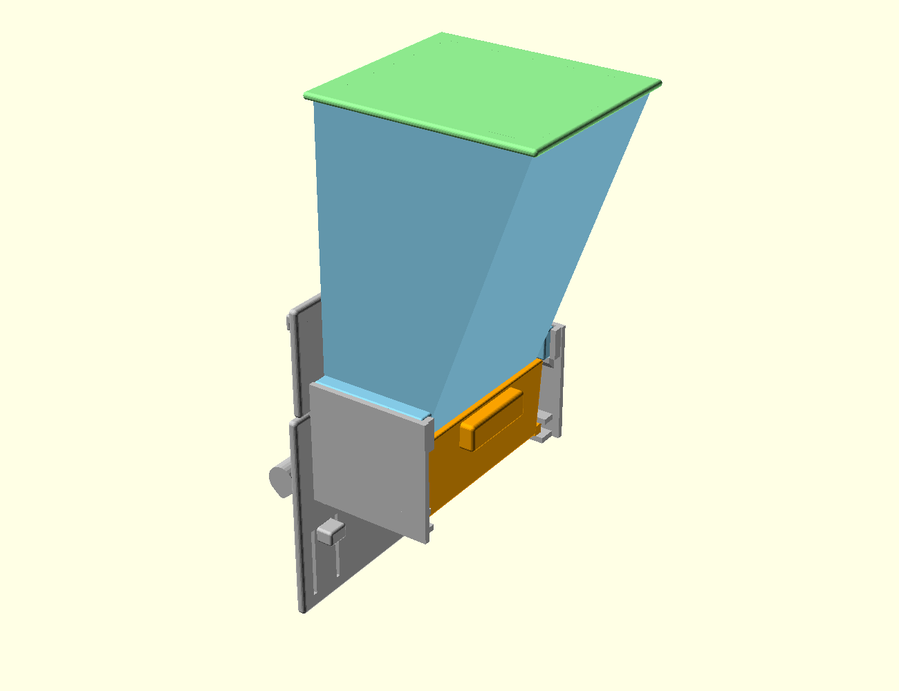

run-id: A2

# Gravity seed hopper for a green-cheek conure, cage-door mounted, PETG on an A1 mini

Four printed parts, no fasteners, no glue: **base** (mount plate, perch, tray guides),
**hopper** (the 1 L wedge), **tray** (slide-out, hull lip), **lid**. Everything is generated
by `hopper.scad`; every claim in the VERIFICATION section below was measured on the exported
meshes, not on the source.

```
openscad -D 'part="base"'   -o stl/base.stl   hopper.scad
openscad -D 'part="hopper"' -o stl/hopper.stl hopper.scad
openscad -D 'part="tray"'   -o stl/tray.stl   hopper.scad
openscad -D 'part="lid"'    -o stl/lid.stl    hopper.scad
openscad -D 'part="assembly"' ...     # all four in service position
openscad -D 'part="cavity"'   ...     # the seed volume as a solid, for measuring capacity
openscad -D 'part="section"'  ...     # cutaway used for img/section.png
```



---

## (a) Approach and tools, and why

**OpenSCAD, not a GUI CAD package.** The brief asks for a parametric model regenerable from
one `part` variable, and it asks for a verification section. A script-driven solid modeller
gives both: every dimension is a named variable at the top of the file, and the same source
can export the real parts *and* purpose-built measuring solids (the seed volume as a solid,
go-gauges, cutaways). Nothing about this shape needs splines or a history tree.

**Verification in Python (trimesh + manifold3d + numpy/scipy), deliberately a second engine.**
Checking an OpenSCAD model with OpenSCAD is circular, and OpenSCAD's CGAL booleans emit
zero-volume slivers wherever two faces are coincident, which is exactly the situation in every
fit check. So the geometry is exported to STL and interrogated by an independent kernel:
watertightness, bounding boxes, solid volumes, pairwise intersection volumes, face-normal
statistics, and inward ray casting for wall thickness. Two of the four real bugs found in this
run (below) were invisible to OpenSCAD and obvious to the mesh checks.

**PrusaSlicer for the print dry run.** It is the only tool in the chain that answers "will
this actually print", and it independently confirms the overhang analysis: the two parts my
face-normal analysis called support-free sliced without a support warning; the two it flagged
got one.

Everything runs from nixpkgs with `nix-shell -p`; nothing was installed. `./pyrun <script>` is
a two-line wrapper that enters the Python environment.

## (b) What I actually did, including the dead ends

1. **Fixed the flow geometry first**, because it drives everything else. Plane flow, one
   converging wall at 70 degrees, the other vertical, constant width, outlet a full-width slot
   50 mm across the converging direction (2x the 25 mm banana slice). No funnel, no round
   throat, nothing that narrows in two directions at once. The cavity is a straight prism
   extruded across the width, so a slice cannot key across the outlet.
2. **Sized the volume from the wedge integral**, then measured it instead of trusting the
   arithmetic: `part="cavity"` exports the seed volume as a solid and trimesh reports
   1 006 130 mm3.
3. **Mount, first attempt: hooks with 16 mm wide fingers.** Dead end. A finger that wide fits
   neither through the clear opening (it sits outside the opening's width, at |y| = 47..63) nor
   between 12 mm-pitch bars. The mount as drawn could not be installed on any cage. Fixed by
   cutting the retention down to eight **4 mm fingers placed on the 12 mm bar pitch**, so each
   passes between two bars; see VERIFICATION 5 and 11 for the measured sections.
4. **Latch tongue, first attempt: severed.** The aperture cut removed the plate above the
   tongue's root, so the two tongues came out as separate solids. `body_count = 3` caught it.
   Fixed by extending the flange skirt to z = -95 and rooting each tongue at its bottom edge,
   which also lengthened the flexure to 21 mm of 2.4 mm-thick PETG (about 2-3% surface strain
   at the 3.5 mm snap-in deflection, a one-time flex).
5. **A rounding helper that silently grew parts.** `rb()` builds a rounded box as the hull of
   eight spheres inset by r; when r exceeded half a box dimension the inset flipped and the
   solid grew by r on each side. The tray's rim was 2 mm taller than drawn and fouled the
   hopper (641 mm3) and the posts (22 mm3). Found by the pairwise intersection check, not by
   looking. Fixed **inside `rb()`** by clamping r to half the smallest dimension, which kills
   the whole class of error rather than the one call site.
6. **Width stack-up, reworked twice.** The tray must catch everything the slot drops, so the
   tray cavity has to be wider than the slot; but the tray also has to pass through the opening
   and slide out past whatever supports the hopper. The first two arrangements had the hopper's
   support ledges inboard of the tray, which either narrowed the tray below the slot width or
   collided with its rim. Final arrangement, outward from the centre: slot 90, hopper walls at
   +/-48, tray walls at +/-48.5 wrapping *outside* them, tray flanges to +/-52, support ledges
   from 51, side webs from 56. The tray's rim ends 1.0 mm below the outlet plane, so seed
   cannot escape sideways between the two.
7. **Tray detent, first attempt: uninstallable.** A 1.0 mm bump needs 1.0 mm of lift to clear,
   and the tray only had 1.0 mm before its rim hit the posts. Reduced to 0.6 mm and *verified
   the kinematics* rather than reasoning about them: VERIFICATION 12 walks the tray out in
   steps, with and without the release lift.
8. **A knife edge at beak height.** The aperture was cut with a 3D-rounded box, whose corner
   radius in x left two tapering fins along the top edge of the opening the bird puts its head
   through. The thickness ray-cast found them (0.00 mm). Replaced with a profile extruded along
   x, with a 1.5 mm chamfer flaring toward the cage so the rim the bird contacts is relieved.
9. **Print orientation for the hopper: I did not follow the brief's instruction, deliberately.**
   "Layer lines along the flow" wants the sloped wall flat on the bed. Measured, that
   orientation is 180.1 mm on its longest axis (over the 175 mm limit, and over the bed) and
   needs support on 26.2% of the part's surface, all of it inside the flow path. Printed
   upright it is 111.7 x 111.2 x 151 mm with **zero** faces past 45 degrees and no slicer
   support warning. Upright, the 70-degree wall's layer steps are 0.2/tan70 = **0.073 mm**,
   which is 30x smaller than the smallest seed in the mix and far less obstructive than the
   support scars the other orientation would leave in the chute. The alternative orientation is
   measured and reported alongside so the trade is visible.
10. Ran the full check suite after every geometry change; the numbers below are from the final
    source (`verify.txt` is the captured run).

## (c) The design as built

Coordinates: origin at the centre of the door opening, +x out of the cage, +z up. The cage wall
occupies x = 0..3.5.

| Part | Bounding box (mm) | Solid volume | Sliced mass / time | Print orientation |
|---|---|---|---|---|
| base | 106.0 x 140.0 x 165.0 | 112.7 cm3 | 105 g, 9 h 31 m | as it hangs, flange plate vertical |
| hopper | 111.7 x 111.2 x 151.0 | 182.1 cm3 | 200 g, 14 h 29 m | upright, outlet on the bed |
| tray | 78.5 x 104.0 x 43.0 | 75.9 cm3 | 69 g, 5 h 38 m | opening up |
| lid | 118.6 x 103.0 x 15.5 | 55.2 cm3 | 50 g, 4 h 40 m | plate down, plug up |

Totals: 424 g of PETG, about 34.5 h of printing at 0.2 mm / 15% infill / 3 perimeters.

**Flow path.** Cavity 90 mm wide (constant), front wall vertical at x = 12, rear wall at 70
degrees from horizontal, outlet slot **50 x 90 mm** in the plane z = 14, cavity top at z = 165,
fill line at z = 160. Usable volume to the fill line **1.006 L**; a green-cheek eats roughly
15-20 g of mix a day, so this is well past the 10-day refill target and the tray holds about
another 150 cm3 in reserve.

**Mount.** A 140 x 109 mm flange plate bears on the outside of the bars around the opening. Two
J-hooks per side (four 4.0 x 4.5 mm fingers total) reach over the door frame's top wire; two
sprung tongues (2.4 mm thick, 21 mm of free length) carry four 3.7 x 4.0 mm fingers that snap
under the bottom wire. All eight fingers sit on the 12 mm bar pitch (`fin_y = [46,58]`) and
pass between bars; the clear gap for a 3.5 mm bar is 8.5 mm, so each finger has +/-2.25 mm of
slack, and the whole hopper can be shifted +/-5 mm along the opening (the widest crossing
member is 100 mm in a 110 mm opening) to pick up any bar phase. The tongues release by pulling the two tabs that stand
proud of the flange's outer face, level with the bottom edge of the opening: they are on the
far side of the bar wall, so nothing the bird can reach through the aperture touches them. By
hand calculation each tongue is roughly 13 N/mm and needs about 3.5 mm of deflection to release,
i.e. tens of newtons - a hand calculation, not a verified result.

**Bird side.** Aperture 106 x 54 mm with a 1.5 mm chamfer flaring toward the cage. The tray
presents a 100 x 43 mm face at the wall plane; its rim is a hull-formed rolled lip (two rounded
profiles hulled together), 13 mm above the datum, which is above the seed's resting surface at
the lip (the repose line from the outlet's front edge puts the surface at about z = 7.7). A
16 mm perch, teardrop-sectioned so it needs no support and rounded where the bird grips, runs
90 mm across the opening 22 mm inside the cage, 3 mm below the tray floor level.

**Refill and lid.** The lid lifts off the top of the hopper, 165 mm above the datum and entirely
outside the cage; the bird cannot reach it through a 110 mm opening 150 mm below. It is a flat
plate with a 12 mm wedge plug that matches the cavity's taper, 0.4 mm clearance all round.

**Tray removal.** Pull the handle: the flange grooves ride a 0.6 mm detent on the rails, so the
tray needs a deliberate 0.7 mm lift to start moving; a straight pull is blocked. The retaining
rails cap the lift at 1.0 mm, so the tray cannot be tipped out either.

Parts list, with the only fasteners being printed features: base x1, hopper x1, tray x1, lid x1.
No hardware, no glue, and no part small enough for a conure to swallow or detach: the smallest is the tray at 78 x 104 x 43 mm.

## (d) VERIFICATION

Everything below is a real command and its real output. The full captured run is `verify.txt`.
Scripts: `verify.py` (1-9), `thickness.py` (10), `xsect.py` (11), `detent.py` (12),
`check_mesh.py`, `slice.sh`, `shots.sh`. `./pyrun X` runs X inside the nix Python environment.

### Mesh validity and size — PASS

`./pyrun verify.py`

```
base    faces=13088 bodies=1 watertight=True  winding_ok=True  vol=112.71 cm3  bbox  106.0 x  140.0 x  165.0  max 165.0  PASS
hopper  faces= 1680 bodies=1 watertight=True  winding_ok=True  vol=182.08 cm3  bbox  111.7 x  111.2 x  151.0  max 151.0  PASS
tray    faces= 1948 bodies=1 watertight=True  winding_ok=True  vol= 75.86 cm3  bbox   78.5 x  104.0 x   43.0  max 104.0  PASS
lid     faces=  956 bodies=1 watertight=True  winding_ok=True  vol= 55.17 cm3  bbox  118.6 x  103.0 x   15.5  max 118.6  PASS
```

All four are watertight, consistently wound, and a **single** solid body each (that check is
what caught the severed latch tongues). Largest dimension anywhere is 165.0 mm against the
175 mm limit.

### Capacity — PASS

The seed volume is exported as its own solid and measured, rather than computed by hand:

```
volume = 1006130 mm3 = 1.006 L   requirement ~1 L  PASS
```

### Wall angles in the flow region — PASS

Face normals of the cavity solid, grouped and converted to inclination from horizontal:

```
  normal [ 0.94   0.    -0.342]   area    13983 mm2  wall at  70.00 deg from horizontal
  normal [-1.  0.  0.]            area    13140 mm2  wall at  90.00 deg from horizontal
  normal [-0.  1.  0.]            area    11179 mm2  wall at  90.00 deg from horizontal
  normal [ 0. -1.  0.]            area    11179 mm2  wall at  90.00 deg from horizontal
  minimum wall angle in the flow region = 70.00 deg  requirement >= 60  PASS
```

There is no surface in the flow region between 0 and 70 degrees: the cavity is a prism, so
these four planes are the whole boundary apart from the two open ends.

### Outlet, go-gauge — PASS

A solid block is pushed through the outlet and intersected with every part; a clear outlet
means zero intersection with all four:

```
  outlet 50 x 90: block 50x90x4 at [37, 0, 16] -> CLEAR
  fall path to tray: block 50x90x1.0 at [37, 0, 13.5] -> CLEAR
  banana slice 25 dia x 6 (upright, worst case) in outlet: block 6x25x25 at [37, 0, 26] -> CLEAR
```

The third gauge is a banana slice stood on edge, the worst orientation for keying, passing
through the outlet region with room to spare.

### Fit through the 110 x 110 opening — PASS for everything that crosses the opening

The assembly is clipped to the cage side of the wall plane and differenced against a
110 x 110 prism:

```
  crossing solid bbox: x[-32.0,3.5] y[-60.0,60.0] z[-66.0,63.0]
  material outside the 110x110 window: 1099.3 mm3
     vol=   136.1 x[ -0.99,  3.50] y[ -59.99, -56.01] z[ -65.99, -55.51]   (x4, latch fingers)
     vol=   138.8 x[ -2.99,  3.50] y[ -47.99, -44.01] z[  55.01,  62.99]   (x4, hook fingers)
  of the crossing material within the opening's height band, material outside its width: 0.000 mm3
```

Read this carefully, because it is the one place the design does not fit the requirement's
simplest reading. **Everything that passes through the clear opening fits inside it**: the last
line is exactly 0.000 mm3, i.e. of all the material that crosses the wall plane between
z = -55 and +55, none of it lies outside |y| = 55. That material is the tray, its nose and lip,
and the perch webs.

The eight retention fingers do **not** pass through the clear opening. They cross the barred
wall above and below the door, between the vertical bars, which is how a cage feeder cup mounts.
Their measured sections through the wall plane (VERIFICATION 11) are 4.0 x 4.5 mm (hooks) and
3.7 x 4.0 mm (latch fingers), against an 8.5 mm clear gap between 12 mm-pitch 3.5 mm bars.

### Cross-sections through the cage wall plane

`./pyrun xsect.py` — every solid passing through x = 3.3:

```
   y[ -49.99,  49.99] (100.0 wide)  z[ -29.99,  12.99] ( 43.0 tall)  section area   612.3 mm2   tray + lip
   y[  37.01,  39.99] (  3.0 wide)  z[ -51.99, -41.09] ( 10.9 tall)  section area    31.9 mm2   perch web (x2)
   y[  44.01,  47.99] (  4.0 wide)  z[  58.51,  62.99] (  4.5 tall)  section area    17.1 mm2   hook finger (x4)
   y[  44.25,  47.99] (  3.7 wide)  z[ -65.99, -62.01] (  4.0 tall)  section area    14.4 mm2   latch finger (x4)
   total sectional area 802 mm2
```

The largest single crossing is 100 x 43 mm inside a 110 x 110 opening.

### Interference and motion — PASS

Pairwise boolean intersection of the assembled parts, using manifold3d (not OpenSCAD):

```
base   n hopper =    0.0000 mm3      hopper n lid    =    0.0000 mm3
base   n tray   =    0.0000 mm3      base   n lid    =    0.0000 mm3
hopper n tray   =    0.0000 mm3      tray   n lid    =    0.0000 mm3
```

Service motions, each part translated along its path and re-intersected:

```
  tray slid out 30/45/60/75 mm (base and hopper)   overlap 0.00 mm3   (with the 0.7 mm detent lift)
  hopper lifted 10/40/80 mm (base)                 overlap 0.00 mm3
  lid lifted 5/20 mm (hopper)                      overlap 0.00 mm3
```

Tray detent, walked step by step (`./pyrun detent.py`):

```
tray vertical play against base:      lift 0.8 -> 0.00 mm3;  lift 1.2 -> 3.04 mm3;  lift 1.5 -> 11.01 mm3
withdrawal with a 0.7 mm lift:        out 2,5,10,20,30,45,60,75 mm -> 0.00 mm3 everywhere
straight pull, no lift:               out 3 mm -> 6.75 mm3;  out 5 mm -> 18.75 mm3;  out 10 mm -> 36.00 mm3
```

So: the tray is free to lift 1.0 mm and no further, a straight pull is blocked by the detent
after 2-3 mm, and a 0.7 mm lift releases it cleanly for the full 75 mm withdrawal. The hopper
lifts straight out of its cradle once the lid is off, and the lid lifts off its plug.

### Wall thickness — PASS

Inward ray casting from 6000 area-weighted surface samples per part, discarding rays that hit
the far surface at a grazing angle (those measure a fillet, not a wall):

```
base    rays=6000 face-parallel rays=5795 min= 2.40 p1= 2.40 p5= 3.00 median= 4.97  below 2.4: 136 (2.35%)  below 2.35: 0
hopper  rays=6000 face-parallel rays=5929 min= 3.00 p1= 3.00 p5= 3.00 median= 3.00  below 2.4: 0 (0.00%)  below 2.35: 0
tray    rays=6000 face-parallel rays=5767 min= 3.01 p1= 3.01 p5= 3.01 median= 3.70  below 2.4: 0 (0.00%)  below 2.35: 0
lid     rays=6000 face-parallel rays=5773 min= 2.51 p1= 2.55 p5= 2.70 median= 3.48  below 2.4: 0 (0.00%)  below 2.35: 0
```

Thinnest material anywhere is **2.40 mm**, the two latch tongues, which are 2.4 mm on purpose
because they are the flexures. The "below 2.4" count on the base is those same tongues measuring
2.3999 or 2.4001 depending on the sample; nothing measures below 2.35. Hopper, tray and lid are
3.0 mm shells (the lid's 2.51 mm minimum is its plug wall).

Caveat, stated plainly: this method measures thickness along the surface normal. A wall that is
thin only in some oblique direction would be missed. I did not run a rolling-ball or
medial-axis thickness analysis.

### Printability — PASS, with support needed on two parts

Faces steeper than a 45-degree overhang, first layer excluded, in each part's print orientation:

```
  base   as it hangs             bbox  106.0 x  140.0 x  165.0  unsupported    4754 mm2 ( 8.0%)
  hopper upright (chosen)        bbox  111.7 x  111.2 x  151.0  unsupported       0 mm2 ( 0.0%)
  hopper on sloped wall (alt)    bbox  180.1 x  111.2 x  109.1  unsupported   29209 mm2 (26.2%)
  tray   opening up              bbox   78.5 x  104.0 x   43.0  unsupported     499 mm2 ( 1.2%)
  lid    plate down              bbox  118.6 x  103.0 x   15.5  unsupported       0 mm2 ( 0.0%)
```

Slicer dry run, PrusaSlicer 2.9.4, 0.2 mm layers, 0.4 nozzle, 15% infill, 3 perimeters, 180 mm
bed, supports **off**, so that its own overhang detector speaks:

```
--- base    print warning: Detected print stability issues: Consider enabling supports.
            filament 104.83 g   estimated printing time 9h 30m 42s
--- hopper  (no warning)
            filament 199.56 g   estimated printing time 14h 28m 45s
--- tray    print warning: Detected print stability issues: Consider enabling supports.
            filament  68.60 g   estimated printing time 5h 38m 16s
--- lid     (no warning)
            filament  50.22 g   estimated printing time 4h 40m 3s
```

The slicer agrees with the face-normal analysis part for part. The **hopper**, the part whose
internal finish matters, prints with no support at all: its 70-degree wall is 20 degrees off
vertical, and its outlet face is the first layer. The **lid** prints clean. The **base** needs
support under the perch, its two webs, the tray rails and the ledge undersides (8% of its
surface) - it is a two-sided part, a plate with structure on both faces, and no orientation
makes it support-free; all of that support is on hidden, non-functional undersides. The **tray**
needs a little under its handle and its detent grooves (1.2%). Nothing needs support inside the
seed path.

Everything the bird can reach is rounded: the perch is a hulled teardrop, the tray rim is a
hulled rolled lip, the aperture is chamfered, and all box edges on the base and tray are
sphere-hulled at r = 1.2-2.0 mm.

### What I did NOT verify

- **No physical print, so no flow test.** Whether real sticky banana slices bridge a 50 x 90 mm
  slot is an empirical question; I sized it from the standard plane-flow rule (slot >= 2x the
  critical arching span, here 2 x 25 mm) and verified the geometry, not the behaviour.
- **The cage.** I assumed the door opening is framed by horizontal wires at its top and bottom
  edges (which is what makes a rectangular opening in a wall of vertical bars) and that the bars
  are round, about 3.5 mm, at 12 mm pitch. `wire_d`, `bar_pitch` and `fin_y` are parameters. If
  the door has no frame wires, the hooks have nothing to grip and the mount must be redesigned.
- **Structural strength.** No FEA. The load path (about 1.2 kg loaded, hanging on four 4 x 4.5
  mm fingers in shear plus a 5 mm plate) is checked only by hand arithmetic, which is not
  included as a verified result.
- **Flexure life.** The 2.4 mm tongue's 2-3% strain estimate is a hand calculation for a
  one-time install flex, not a fatigue analysis.
- **Bird-proofing is geometric, not tested.** I verified that the release tabs are outside the
  cage and that nothing reachable through the aperture moves the mount; I did not model beak
  loads.
- The last block of `verify.txt` probes a lift-in installation (assembly lowered 9 mm) that
  belongs to an abandoned mount concept; it shows the perch dropping below the opening, which
  is why that concept was dropped. It is not a check of the delivered design.

## Clean room

Designed from this brief alone. I did not read, list, search or fetch any prior or parallel
hopper design, any sibling directory under `~/scratch/hopper-critic/`, `~/repos/bddap-bot/3d-models`,
the GitHub repo, `~/.local/state/botq`, `~/.local/state/bot-agent`, or any notes or memory file.

One incident to record: the session harness injected a memory index into my context
unbidden at session start, one line of which referenced perch ergonomics on bird feeders. I did
not open that file or act on it, and the perch here is placed below the tray because this brief
says "integrated perch below the tray".

## (e) Wall time

Start 18:16:45, finish 21:02 local, **2 h 45 m** wall clock, single session, including the
nixpkgs fetches for OpenSCAD, the Python stack, xvfb/mesa and PrusaSlicer.

## Files

```
hopper.scad                 parametric source; top-level `part` selects the export
stl/base.stl                mount plate, hooks, latches, perch, tray guides
stl/hopper.stl              1 L wedge
stl/tray.stl                slide-out tray with hull lip
stl/lid.stl                 lift-off lid
stl/cavity.stl              the seed volume as a solid (verification artefact)
img/assembly_iso.png        assembled, isometric
img/assembly_cage.png       assembled, from the cage side
img/assembly_out.png        assembled, from outside
img/section.png             cut at y=0, seed column shown in wheat
img/section_iso.png         same cut, isometric
img/part_base.png  img/part_hopper.png  img/part_tray.png  img/part_lid.png
REPORT.md                   this file
verify.txt                  captured output of the whole check suite
verify.py check_mesh.py thickness.py xsect.py detent.py gauges.py   checks
pyrun shots.sh slice.sh     environment wrapper, renders, slicer dry run
```
