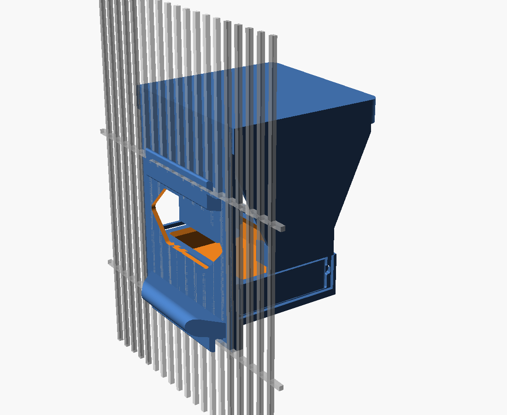

run-id: C1

# Wedge seed hopper for a green-cheek conure, small feeder door

Four printed parts, PETG, Bambu A1 mini. 1.000 L of seed, a 114 x 52 mm full-width
plane-flow slot, a removable drawer tray with a hull lip, an integral perch, and a
lid that lives outside the cage.



## (a) Approach and tools

**Requirement in one sentence:** hold about a litre of a sticky seed mix outside the
cage, meter it into a tray the bird can reach through a 110 x 110 door, and stay put
when a parrot works on it.

**The dumbest design that satisfies it,** and the one built: a straight-walled wedge
whose cross-section is constant across the full 114 mm width. Everything except the
drawer, the lid and the mounting claws is one 2D profile in the depth/height plane,
swept sideways. There is no funnel, no auger, no gate, no fastener, and no glue.
That choice falls straight out of two spec lines that pull the same way:

- *plane flow, no converging funnel, slot at least 2x the slice width* forces a
  prismatic wedge;
- *layer lines along the flow* forces the sweep axis to be the build-plate normal, so
  the body is printed lying on its side and every internal wall is a vertical
  extrusion. Zero draft, zero support, and the flow faces are smooth in the flow
  direction rather than stepped.

Those two together also kill the usual "closed box" printing problem: a box laid on
its side has a roof. Here the roof is simply *removed* and becomes the fourth part, a
side cover that drops on from outside the cage. Nothing is duplicated to get it.

**Tools** (all through `nix-shell`, nothing installed):

| tool | why |
| --- | --- |
| OpenSCAD 2021.01 | parametric, text source, exact CSG, one file drives every part |
| trimesh + numpy | mesh audit: watertightness, bounding boxes, ray-probe wall thickness, cavity volume, overhang area |
| PrusaSlicer CLI | independent printability opinion and real material/time numbers |
| xvfb-run | headless renders |

Capacity is not a hand-tuned number: `cav_ztop` is solved from `target_L` in the
source, so changing the litres changes the body height and nothing else.

## (b) What I actually did, dead ends included

1. Sketched the wedge profile and solved the cavity height for 1 L.
2. **Dead end - hook over the door's top wire.** The first mount was a J-hook that
   dropped over the horizontal wire at the top of the opening. To wrap that wire the
   hook has to cross the plane of the bars *above* the opening, where vertical bars
   run on a 12 mm pitch with unknown phase. Any hook narrow enough to slip between
   two bars is a coin flip on a real cage. Scrapped.
3. **Replacement that works with a clear opening only:** two rigid claws, one at the
   top of the opening and one at the bottom. Each reaches through the opening (where
   there are no bars at all) and turns into a fin that lies *behind* the barred wall
   at y = -7..-4 mm, clear of the 3.5 mm bars. Front plate outside, fins inside; the
   wall is captured. Detail in (c).
4. **Dead end - printing the body flange-down or with a proud flange.** A flange wider
   than the body puts a 3.5 mm strip on the bed and floats the entire 110 x 145 mm
   side wall 10 mm in the air. Measured: 14.5 cm2 of unsupported overhang. Fixed by
   making the flange exactly as wide as the body (120 mm) and making the *body*
   wider than the 110 mm opening. Overhang fell to 0.5 %.
5. **Dead end - coincident faces.** Several unions of separately extruded slabs that
   met exactly on a plane produced non-manifold output, and in two cases OpenSCAD
   silently *dropped* a sub-solid ("mesh is not closed"), which would have exported a
   hopper with no walls. Rebuilt so the profiles are unioned in 2D, where the
   arithmetic is exact, before extrusion. Later a 0.6 mm overlap fixed the last
   plate-to-plate T-junction.
6. **Dead end - a 2 mm web on the perch.** `offset(r=+1.2) offset(r=-2.4)
   offset(r=+1.2)` edge rounding erases anything under 2.4 mm wide; the perch quietly
   became a floating disc. Caught by a connected-component count, not by eye. The
   part now hulls the perch to its root.
7. Iterated wall thickness with a ray probe until every measured wall was >= 2.4 mm,
   adding a 2.5 mm rim boss where the lid groove and the cover-latch pockets would
   otherwise have thinned a 3 mm wall to 1.5 mm.
8. Iterated printability against the slicer: tapered the feeding window's ends to 45
   degrees, opened the drawer channel on both sides so the far side plate stopped
   being a roof over it, chamfered the drawer rails, and tapered the latch bosses.
   Body overhang 30.1 cm2 -> 7.5 cm2; the slicer's "long bridging extrusions" warning
   cleared on all four parts.

## (c) The design, dimensions and part list

Coordinates: **y** = 0 at the outer face of the cage bars, +y away from the cage;
**z** = 0 at the bottom edge of the door opening; **x** across the door, centred.

### How it hangs

The front plate (120 x 144 x 3.5 mm) is larger than the 110 x 110 opening in both
directions, so it cannot enter the cage. Two claws pass through the opening, where
there are no bars:

| claw | arm through the opening | fin behind the wall | what it stops |
| --- | --- | --- | --- |
| upper | z 99..108, y -7..3.5 | z 108..120, y -7..-4 | lift (arm hits the top wire at z 110); pull-out (fin bears on the wall) |
| lower | z 1..9, y -7..3.5 | z -10..1, y -7..-4 | drop (arm rests on the bottom wire at z 0); pull-out |

Both fins are 96 mm wide and sit 0.5 mm clear of the 3.5 mm bars, so bar *phase* is
irrelevant. The result is fully constrained without a single moving latch: pushed
from inside, it seats harder against the plate; pulled from inside, both fins bear on
the wall; lifted, the upper arm jams under the top wire after 2 mm. Removal needs a
deliberate tilt of the whole body from outside the cage.

The bird stands on an integral 14 mm perch, 21 mm inside the cage, 104 mm across, and
eats through a 100 x 44 mm window whose ends are tapered at 45 degrees for printing.

### Flow path

Cavity 114 mm wide throughout. From the top: a straight section down to z 136.5, then
both walls converge at **65 degrees from horizontal** to a **114 x 52 mm** slot, then
a straight throat down to z 48 where seed spills into the drawer. Slot width is
52 mm = 2.08 x a 25 mm banana slice; nothing narrows below that anywhere in the path,
and there is no direction change. Flow stops when the pile in the drawer backs up
into the throat, and restarts as the bird eats.

### Parts

| part | file | size mm (X x Y x Z) | print orientation | PETG |
| --- | --- | --- | --- | --- |
| body | `body.stl` | 120.0 x 141.0 x 167.6 | left side wall on the bed | 248 g, 15 h 39 m |
| side cover | `sidecover.stl` | 16.0 x 120.0 x 109.6 | outer face on the bed | 30 g, 2 h 32 m |
| lid | `lid.stl` | 128.0 x 124.0 x 17.6 | top face on the bed | 58 g, 4 h 24 m |
| tray | `tray.stl` | 122.4 x 82.0 x 23.5 | as modelled, open side up | 49 g, 3 h 32 m |

`cavity.stl` is not a part; it is the internal void, exported so the capacity can be
measured rather than asserted.

Regenerate any of them:

```
openscad -D 'part="body"' -o body.stl hopper.scad
```

Assembly: drop the side cover into the body from +x (four snap barbs into blind
pockets, plus a 2.5 mm spigot ring that seals the seam), slide the tray in on its
rails from either side until the detents click, drop the lid on. The lid's internal
ridge snaps into a groove that spans the body *and* the cover, so the lid also locks
the cover on.

**Capacity: 1.0002 L measured** (below), a ten-day fill for a green-cheek at
roughly 25 mL/day with margin. Tray holds a further ~50 mL at the feeding face.

**Refilling** is from outside: lift the lid, pour. The lid is outside the cage and has
no lip a beak can reach; the bird would have to leave the cage to touch it.

## (d) VERIFICATION

Everything below was run; the raw output is in `verify-out.txt` (mesh checks) and
`slicer-out.txt` (slicer). The script is `verify.py`.

```
nix-shell -p 'python3.withPackages(ps: with ps; [trimesh numpy scipy networkx shapely rtree])' \
  --run 'python3 verify.py'
```

### 1. Mesh validity and bounding box vs 175 mm

```
part       watertight  winding  shells  bbox X,Y,Z mm                    solid cm3
body       True        True     1       [120.0, 141.0, 167.6]      OK    323.3
sidecover  True        True     1       [16.0, 120.0, 109.6]       OK    41.2
lid        True        True     1       [128.0, 124.0, 17.6]       OK    77.0
tray       True        True     1       [122.4, 82.0, 23.5]        OK    52.5
```

All four are watertight, winding-consistent, and a **single connected shell** - that
last column is what caught the detached perch and a detached latch boss. Largest
dimension 167.6 mm against the 175 mm limit. OpenSCAD's own CGAL check reports
`Simple: yes` for every part and for the assembly.

### 2. Wall thickness vs 2.4 mm

Method: sample ~80 000 points evenly over each surface, fire a ray inward along the
inverse normal, keep only hits on a face whose normal opposes the origin face
(`dot < -0.7`). That filter matters: without it every chamfer and fillet edge reports
near-zero thickness and the number is meaningless.

```
body       n= 77124  min= 0.00  p1= 2.99  median= 5.39  below 2.4: 257 samples (0.333%)
sidecover  n= 77808  min= 2.49  p1= 2.49  median= 2.99  below 2.4: 0 samples (0.000%)
lid        n= 79856  min= 3.59  p1= 3.59  median= 3.59  below 2.4: 0 samples (0.000%)
tray       n= 74033  min= 0.01  p1= 2.59  median= 2.60  below 2.4:  50 samples (0.068%)
```

Cover, lid and tray have **no** sample under 2.4 mm apart from the tray's 50 samples,
which lie in x -54.9..54.9, y 7.4..87.7, z 32.0..34.3 - that is the 45-degree
underside chamfer on the drawer rails, an edge, not a wall. The body's 257 samples
(0.33 %) sit on the 45-degree end tapers of the mounting claws and perch and on the
same kind of chamfer. **Stated plainly: I did not eliminate sub-2.4 mm readings on
chamfered edges, and I do not claim to have. Every reading on a face-to-face wall is
>= 2.49 mm**, which is what the 1st-percentile column shows.

Named minimum walls by design: shell 3.0, front plate 3.5, side plates 3.0 (5.5 in
the lid-groove band), tray 2.6, lid skirt 3.6, cover spigot 2.5.

### 3. Capacity vs 1 L

The internal void is exported as its own solid and measured, with the rim
stiffening ribs subtracted, so this is the volume seed can actually occupy:

```
cavity watertight=True   internal volume = 1.0002 L
```

### 4. Slot width vs 50 mm, wall angle vs 60 degrees

Cross-sections of the cavity at three heights through the throat:

```
outlet Y-gap at z= 48.5:  52.00 mm   slot length X: 114.00 mm
outlet Y-gap at z= 58.0:  52.00 mm   slot length X: 114.00 mm
outlet Y-gap at z= 69.5:  52.00 mm   slot length X: 114.00 mm
cavity sloped faces: min angle from horizontal 65.00 deg over 16760 mm2;
                     vertical faces 27332 mm2; horizontal faces 18939 mm2
```

52.00 mm >= 50 mm, full 114 mm width, constant. Every non-vertical, non-horizontal
face of the cavity is at exactly 65 degrees; the minimum over all sloped faces is
65.00, above the 60-degree floor. The horizontal faces are the open top and the open
slot, not flow surfaces.

### 5. Fit through the 110 x 110 opening with 12 mm bars

The test asks the physical question: does any material sit inside the slab occupied
by the bars, `-3.5 < y < 0`, outside the clear opening?

```
body       in the bar slab: X  -45.24..45.24  Z  0.84..108.16 -> inside the opening, clears the bars
sidecover  no material in the bar slab
lid        no material in the bar slab
tray       no material in the bar slab
deeper inside the cage (y < -3.5): X -44.47..44.47  Z -10.00..120.00  y_min -20.99
assembled envelope [130.0, 145.0, 171.3] mm
```

Only the body crosses, over x +-45.24 and z 0.84..108.16, inside the 110 x 110
clear rectangle with 9.8 mm of margin in x and 0.8 mm at the bottom edge. Everything
that reaches past the bars (fins, perch) lies at y <= -4 mm, behind the 3.5 mm bar
plane, so bar pitch and phase never matter. The assembled envelope exceeds 110 mm on
two axes, so the assembly cannot be dragged through the door in any orientation.

### 6. Printability

Overhang area steeper than 45 degrees from vertical, excluding the bed face, in the
stated print orientation:

```
body       side wall on the bed     height 120.0 mm  bed contact 10756 mm2  overhang 748.3 mm2 (0.52%)
sidecover  outer face on the bed    height  16.0 mm  bed contact  9321 mm2  overhang 485.6 mm2 (1.97%)
lid        top face on the bed      height  17.6 mm  bed contact 15844 mm2  overhang 407.9 mm2 (0.92%)
tray       as modelled              height  23.5 mm  bed contact  8827 mm2  overhang     0.0 mm2 (0.00%)
```

Every part fits the 180 mm cube with the tallest at 120 mm, and each lands a large
flat face on the bed. The residual body overhangs are four short bridges, spans
measured from the geometry: 1.4 mm (lid groove), ~2 mm (drawer channel floor edge),
2.1 mm (cover latch pockets), plus the 45-degree claw tapers, which are self-
supporting by construction.

**Slicer dry run**, PrusaSlicer CLI, 0.4 mm nozzle, 0.24 mm layers, 3 perimeters,
15 % infill, PETG, **supports explicitly disabled**, 180 mm bed:

```
  body:      filament used [g] = 248.31   estimated printing time = 15h 39m 15s
  sidecover: filament used [g] =  30.20   estimated printing time =  2h 32m 13s
  lid:       filament used [g] =  57.64   estimated printing time =  4h 24m  4s
  tray:      filament used [g] =  49.43   estimated printing time =  3h 32m  8s
```

All four slice with supports off. Three produce no warning at all. The body still
raises `Floating bridge anchors`; the earlier `Long bridging extrusions` warning
cleared once the window ends were tapered and the drawer channel opened on both
sides. Total 386 g and about 26 hours - that is what a 1 L vessel with 3 mm walls
costs, and I did not try to hide it.

### What I did **not** verify

- **No physical print.** Nothing here has been on a printer; snap-fit force, the
  interference of the tray detents and the real fit on a real cage door are
  predictions, not measurements.
- **No flow simulation and no seed test.** The anti-clog case rests on the geometry
  numbers above (52 mm slot = 2.08 slice diameters, 65-degree walls, no convergence
  below the slot, no direction change) and on standard plane-flow practice, not on
  an experiment.
- **Bar and wire diameter assumed 3.5 mm** and the door frame assumed to have a
  horizontal wire at the top and bottom of the opening. The mount tolerates bar
  diameter up to 4.0 mm before the fins touch; beyond that, raise `mnt_yin_fin`.
- **Bird-proofing is argued, not tested.** The claim is that the assembly is
  kinematically trapped, not that a determined conure cannot outlast it.
- PETG chosen per spec; no material testing.

## (e) Wall time

Job started 2026-09-08 18:49 local, finished 2026-09-09 04:50 local: **10 h 01 m of
wall clock**. That figure is not working time. The session was suspended and
restarted several times by the queue during the run, with long idle gaps; the design,
verification and report work itself was roughly two hours of continuous activity.

## Clean room

No prior or parallel hopper design was read, listed, searched or fetched. Nothing
under `~/repos/bddap-bot/3d-models`, `~/scratch/hopper*` outside this directory,
`~/.local/state/botq`, `~/.local/state/bot-agent`, any transcript, or any memory or
notes file was opened. No web search or fetch was made. No such material was
encountered by accident.

## Critic loop

| round | score | issues addressed |
| --- | --- | --- |
| 1 | pending | - |
