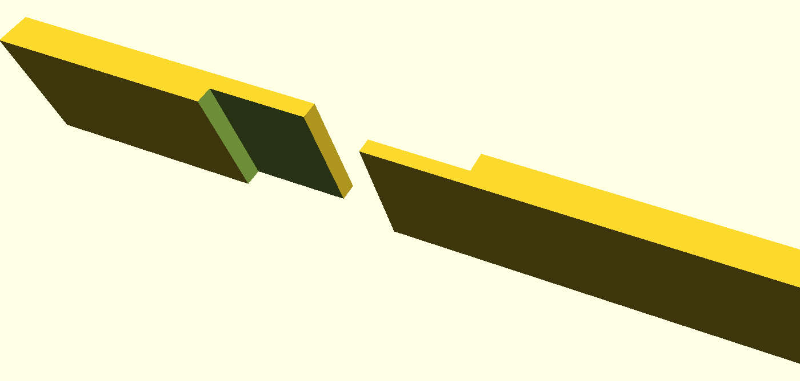
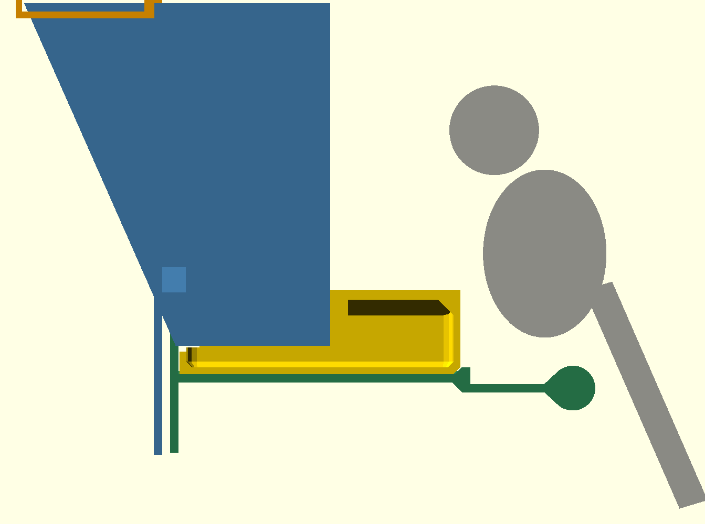

Evolved design derived from the [fable submission](../fable/REPORT.md): the same five parts, with the body seam turned from a butt joint into a self-locating lap, the bracket snapped onto the body instead of resting under it, and the perch moved out from under the tray to where a bird can use it.

# Green-cheek conure seed hopper v2 — design report

Directive (verbatim): "it's not realy clear how this fable bird hopper submission is meant to hold together. did your worker... cut to hopper in half to avoid needing supports? if so it succeed in not needing supports, but a sliced-in half hopper doesn't hold bird seed ;)"

Report (verbatim):

> the bottom parts don't actuallly attach to the hopper, just expected to be held there by the bottom of the cage door i suppose.
> the perch is directly under the edge of the feeder bowl
> the perch points down, only usable by inverse-gravity conures

## (a) Approach and tools

**Tools:** OpenSCAD 2021.01 (parametric source; STLs and previews through the root `./build`; section renders via xvfb), Python 3.13 + trimesh 4.9 / manifold3d / shapely / scipy (mesh validity, thickness, sections, booleans, the seam-void raster, the shifted-bracket retention booleans, print-orientation overhang audit), PrusaSlicer 2.9.4 (slicer dry run, PETG, 180 mm bed). All from nixpkgs via `nix-shell -p`.

**Design in one sentence:** a plane-flow wedge (one vertical wall, one wall at 66°, parallel end walls) whose whole cross-section passes through the door opening, refilled through a sliding lid outside the cage and dispensing through a 50 mm × 130 mm slot into a hull-lipped tray inside; the tray rides on a bracket that snaps onto the body's end walls, and the bracket carries the perch 40 mm in front of the tray and 27 mm below its lip; the body is two halves split on the mid-plane so each prints end-wall-down, and the halves meet on a lap joint.

**Why two halves, still:** printing the body on its end wall (X axis vertical) puts every hopper wall in the layer plane, so layer lines run along the flow; a one-piece body in that orientation has a 110 × 130 mm ceiling. Two mirror halves have no overhang beyond a 3.6 mm bridge and, in v2, the 8 mm² of the catch pockets inside it. The fable submission left the seam a plain butt joint: nothing located one half to the other, and the gap was whatever the bracket and lid tolerances gave.

**The seam:** a half-lap along the whole seam. Each 2.4 mm wall is split at its mid-surface; on `body_R` the outer half (the tongue, `t/2 − seam_clr` = 1.0 mm thick) runs `seam_lap` = 6 mm past the seam plane, on `body_L` the outer half is cut back by `seam_lap + seam_clr` (the pocket) while its inner half runs to the seam. The tongue sits in the pocket with `seam_clr` = 0.2 mm on every face: 0.2 mm between the inner skins at the seam plane, 0.2 mm between tongue and pocket floor, 0.2 mm at the tongue's end. Seed leaving the cavity would have to pass a 0.2 mm slit, turn 90°, run 6 mm along the lap, and turn again: seed cannot, seed dust still can (a labyrinth slows dust, it does not stop it). Both ends of the lap channel open at Z = 0, directly over the tray, so what weeps through lands in the tray. Seed-tight by geometry, not by clamping. The lap on the 66° back wall, the vertical front wall and the horizontal roof locates the halves in Y and Z; the bracket window and lid channels hold them together in X as before. The stop lip is lapped the same way (split in Y). The bottom flange is outside the cavity and carries no seed, so it is wholly on the tongue side (an offset butt with the same 0.2 mm gap): a lap there would put the flange's inner half under the wall's tongue with zero clearance.

**Why a lap and not:** a tongue-and-groove (a groove in a 2.4 mm wall leaves 0.6 mm cheeks; the tongue would be under 1 mm anyway); a cover strip (a sixth part, and the seam is still a butt joint under it); a full nesting sleeve (one half's cavity shrinks by a wall thickness, the halves stop being mirror images and the flow section steps at the seam); pins (extra parts, no seal). The lap is the one joint that seals, locates, needs no new part, and in the existing print orientation is nothing but a wall that stops 6 mm short or runs 6 mm long.

**The attachment:** in the fable design the bracket's window edges sat 5.7 mm deep in vertical slots in the body's end walls, which located the bracket in X and Y and let it slide straight down and off. v2 keeps the slots and turns each window edge into a snap finger: a 2.4 × 3 mm cantilever, 19.7 mm long, rooted at the window sill and freed from the plate by a 1.5 mm slit, with a barb on its inner face 1.2 mm deep. The body's slot floor gets a matching pocket. The bracket goes on from below: the fingers ride up the slots, the barbs' 45° lead-ins push the fingers 0.9 mm outward at the slot floor, and 18 mm up the barbs drop into the pockets and rest on the pocket floors. Down is then stopped by the barbs on the pocket floors (0.9 mm of overlap per finger, 3 mm wide), up by the window sill against the back wall's bottom edge as before; X and Y by the slots as before. The tray slides onto the shelf over a 2.5 mm lip and, once under the body, can only lift 2 mm before its rear wall meets the body, so it leaves only with the bracket. Nothing is glued or screwed; the bracket comes off again by pulling each finger outward in its slit (a fingernail's worth, 0.9 mm) while lowering the bracket.

**In the source** the catch is one 2D feature, `catch(g)`: the barb's triangle in the X–Z plane offset by `g`. The bracket unions `catch(0)` onto each finger; the body subtracts `catch(catch_clr)`, swept over the slot's Y range, from each end wall. `catch_clr` = 0.3 mm is the one clearance, the same figure the plate already has in the slot. `catch_d` (barb depth), `z_catch` (barb height above the outlet) and `slit` are the other new parameters.

**Why a snap finger and not:** a ledge in the slot for the plate to rest on (the plate enters from below, so a ledge in its path is a wall; a ledge it could pass needs a bayonet turn the plate cannot make between the bars and the tray); a hook over the top of the body (the lid is there and the plate would have to be 120 mm taller); a flexure on the body side (above the outlet the slot floor is the rib that seals the cavity from the slot, and a slit in it opens the cavity into the slot; below the outlet a finger hanging from the end wall would sit where the bracket plate is solid, so the plate needs a notch there, and in the bracket's end-on print that notch's roof is the same cantilever the fingers were; the finger's own underside is a 3.6 mm ceiling unless the slot cheeks hang down with it); a step in the slot for a plain stub, reached by sliding one body half along the lap (the halves cannot move towards each other on a 0.2 mm lap, and a half slid outward puts the stub under its back wall's foot instead of beside the slot); moving the engagement outside the end wall as a raised rail (anything proud of the end wall's outer face lifts that whole face off the bed in the body's print); a wedge or friction fit (not positive). The finger is the standard positive latch, and printed flat it is nothing but a slot cut into a plate.

**The bracket now prints flat, plate on the bed.** The fable bracket stood on its X end, and in that orientation a finger in the slot is a horizontal bar hanging over the window opening with nothing under it: a 20 mm cantilever, unprintable clean. Flat, the fingers and barbs lie in the first 3 mm and print perfectly; every other feature of the bracket was a Y–Z profile extruded along X and stays one, so it becomes a wall rising from the plate. Two consequences, both in the profile: the tray-stop lip at the shelf's cage-side end is now 2.5 mm tall with a 45° buttress under it (the tray's front-bottom edge gets a matching 2.5 mm chamfer, and the tray cavity's floor edge gets a 2 mm 45° chamfer all round so the wall behind the outer chamfer stays 3 mm), and the block that carries the arm below the shelf has a 45° gusset. The bracket's print height is 151.5 mm, most of it the 3 mm shelf wall; it wants a brim and slow outer walls.

**The perch:** the fable perch hung under the tray's front edge with a third of its diameter under the tray; a bird standing on it had the lip in its chest. v2 puts the perch axis `perch_fwd` = 40 mm in front of the tray's front face (48 mm in front of the lip's tip) and `perch_drop` = 35 mm below the lip's top, so the perch's top is 27 mm below the lip. A green-cheek conure standing on it faces the tray with its chest 8 mm clear of the tray's front face, the bottom of its head 41 mm above the lip, and leans in to eat over a lip that is at its chest height (a standing conure-sized envelope, torso 44 × 60 mm and head Ø32 mm, is drawn in the section below). Forward is what matters, the report on the opus print said the same, so the chest clearance is taken at the tray's face rather than the lip tip. The perch is carried on a 3 mm arm at axis height from the block below the shelf. To print flat the perch is a teardrop rather than a cylinder: Ø16 drawn out to a point toward the tray at the arm's height (a 0.4 mm flat, inside the arm), so its underside in print is never flatter than 47°. Its top and back, where the feet are, are round. The arm's top face sits 6.5 mm below the perch's top; a bird's front toe tips reach it, and what spills over the lip lands on its 25 mm between the tray and the perch. The flat print forces both: a perch printed lying down needs support along its whole length and at its lowest print point, which is its tray-side point at axis height.

**The perch axis** is horizontal along the cage wall, in the fable design and in v2 (measured below: principal axis of the perch rim vertices is X to 0.0°). It was only the fable bracket's print orientation, standing on its X end, that put the perch vertical, and a loose bracket stood on its print end because nothing held it in any other attitude. v2's bracket prints flat, so the perch is horizontal on the bed as well.

**Parts (5):**

| part | role | print orientation | filament (PrusaSlicer) |
|---|---|---|---|
| body_R | wedge half with the tongue; through the door; outer bottom flange bears on bars below the opening | end wall on bed, seam up (tongue is the top 6 mm) | 107 g, 8.7 h |
| body_L | wedge half with the pocket | end wall on bed, seam up (outer skin stops 6.1 mm below the top) | 99 g, 8.1 h |
| lid | slides out (away from cage) to refill; headboard bears on bars above/beside the opening and is the body's inward stop | flat, headboard up | 51 g, 4.4 h |
| bracket | inside the cage: plate bears on bars, snap fingers in the end-wall slots (X, Y and Z lock), shelf + guide rails + lip for the tray, arm + perch | flat on its plate, shelf and perch up | 118 g, 9.1 h |
| tray | removable, hull lip on front and sides; slides in from the cage side over the lip (lift front 2.5 mm) | floor down | 71 g, 6.6 h |

**Mounting / assembly:** slide the two halves together on the lap (tongue into pocket, 0.2 mm play) and push them through the door opening from outside, seam vertical; from inside push the bracket up over the body so its fingers enter the slots in the end walls (slots at Y 0–3.6, plate at Y 0.3–3.3, bars sandwiched between the lid headboard / bottom flange at Y ≤ −2.5 and the plate) until the barbs snap into the pockets; slide the lid in from outside until it hits the stop lip; slide the tray onto the shelf over the lip. Outward pull (bird) → slot cheeks push the plate against the bars. Inward push (human) → stop lip → lid headboard → bars, plus bottom flange → bars. Down (gravity, bird on the perch) → barbs on the pocket floors. Lid opens only by sliding outward, outside the cage. No part is smaller than the lid (165 × 52 × 44 mm); there are no screws, pins or glue.

## (b) Steps taken, including dead ends

1. Restructured the source so the whole body is one `body()` and a half is `body()` cut by a seam shape, then wrote the lap as a 2D cross-section feature applied over a length in X. A plain minimum-distance check between the halves could not serve as the seam-gap check: at the tongue's root a 0.2 mm step faces down a 6 mm channel, so a ray across the seam reads 6.3 mm there, and the Euclidean closest-point distance reads 0.28 mm at re-entrant corners. The check that measures what matters (can anything wider than the clearance sit anywhere in the void) is the widest square that fits in the seam void, from a 0.01 mm raster of the two halves' sections.
2. First lap put the flange's outer half on the tongue and its inner half on the pocket side; the wall's tongue then rested on the flange's inner half with zero clearance (manifold reported a 5e-5 mm³ contact). Moved the whole flange to the tongue side.
3. The pocket cutter's outer boundary coincided with the body's outer face and CGAL left a zero-thickness sheet on `body_L` (one internal face, +1460 mm² of surface). The cutter now extends 1 mm past the outer face.
4. The flange's rectangle in `lap` swept up into the back wall where the wall crosses the flange's Y range, making the wall's tongue full-thickness for a few mm of height. Bounded it by the wall's outer face, the same half-plane that trims the flange itself.
5. Section renders of a CSG intersection in preview mode show z-fighting and lose the parts' colours; the section parts now `render()` each clipped part before colouring it, and the seam figure is a full `--render`.
6. Rewriting the half-body as one full `body()` widened the lid-channel cut from X ∈ [−2, 65] to X ∈ [−66, 66], shaving 1 mm off each end wall above the lid (a 1.4 mm sliver, 22 thin samples on each half). The thickness audit caught it once the lap's own sub-2.4 samples were split out of the count; the cut now ends at the end walls' inner faces.
7. A butt-gap readout from section vertices (`min x > −lap/2` on one half against `max x` on the other) picked a triangulation crossing on the front wall (−2.9 mm); deleted. The raster seam-void check already measures the butt gap.
8. First catch: fingers 2.2 mm wide (the slot depth 2.5 minus the 0.3 clearance) with a 1.0 mm barb, bracket still printed on its X end. The overhang audit put 294 mm² of flat ceiling on the bracket, twice the fable figure: each finger's underside over the window is a 3 × 20 mm cantilever in that orientation, and no cross-section trick fixes a cantilever (a 45° V-bottom still starts its first layer in mid-air). The fable bracket's 4 mm window stubs were the same overhang, short enough to get away with. Turned the bracket flat; slot depth to 2.7 so the fingers are 2.4 mm, the bird-safety wall figure; barb to 1.2 mm.
9. Flat, the bracket's tray lip (7 mm tall, 3 mm thick, on a 3 mm wall) was a 7 mm and a 12 mm cantilever. Replaced the lip and drop plate by profile polygons with 45° faces under every overhang; the lip shrank to 2.5 mm because its buttress sits where the tray's front-bottom edge was, and the tray got a matching chamfer.
10. The chamfer left the tray's front wall 1.6 mm thick at its foot (the ray from the chamfer face reached the inside corner of wall and floor). A 45° fillet strip inside that corner fixed the straight run, first with internal faces (it shared its faces with the wall and floor exactly and CGAL kept both, two of 132 mm², a thickness ray stopping on them at 1.03 mm), then with a 1 mm overlap, and still left the r=6 corner arcs at 1.6 mm where the strip ended. The cavity cutter now carries the chamfer itself: a hull of the inner outline at 2 mm above the floor and the same outline inset 2 mm at the floor, a 45° edge all round that follows the arcs.
11. The rib that seals the cavity from each slot used to run to the roof. With the fingers 19 mm tall it ends at Z = 28, and its top inside the cavity is a 66° slope like the back wall, because a flat top there is a seed shelf. Its first height, 25.2 mm, put the slope 1.5 mm from the pocket's corner; 28.2 mm puts it 2.7 mm away (perpendicular distance from the source geometry).
12. The interior-face audit (which faces inside the cavity face upward, and at what angle) used a box filter around the cavity that also caught the pocket floors, and a manifold difference of the interior prism minus the body returned the +X pocket void fused to the cavity through shared mesh vertices, so `split` could not separate them. The prism now has the two slot zones subtracted before the difference, and the audit asserts that what remains is one solid.

## (c) Final dimensions, part list, capacity

Coordinates: X across the door, Y through it (negative = outside cage, bars at Y ∈ [−2.5, 0]), Z up, Z = 0 at the outlet, seam plane at X = 0.

- Hopper interior: width 130, height 120 (usable to 116.7 under the lid), depth 50 at the outlet → 101.5 at the top; back wall at **66.2°** from horizontal, front wall vertical, end walls vertical and parallel (plane flow, no convergence in X). Unchanged from fable.
- Seam: lap 6 mm, clearance 0.2 mm; tongue 1.0 mm, inner skin under the pocket 1.2 mm; the tongue's tip is at X = −6.0, the pocket's floor ends at X = −6.2, the inner skins end at X = ±0.1.
- Catch: slots in the end walls at |X| 64.7–67.4, Y 0–3.6, Z 0–20.5, floored by the rib (X 61–64.7 at the slot, 61–65 in the cavity) that ends at Z = 28.2 with a 66° top; pockets in the slot floors at Z 17.7–19.5, reaching X = 63.5 at their tip. Fingers at |X| 65.0–67.4, Y 0.3–3.3, Z −0.5–19.2, slit 1.5 mm outside them; barbs 1.2 mm deep with a 45° lead-in, catch face at Z = 18. Barb tip at |X| = 63.8, pocket floor solid from 63.8 to 64.7: **0.9 mm** of overlap. Bracket play in Z: 0.3 mm down (barb to pocket floor); up, the barbs' lead-ins meet the pockets' lead-ins at 0.42 mm and cam the fingers outward, and the sill meets the back wall's bottom edge at 0.5 mm.
- Perch: teardrop, Ø16 round drawn out toward the tray; axis at Y = 143.8, Z = −15.0, along X over the bracket's full 165.4 mm; its faces leave the arm at Y = 133.7. Tray front face Y = 103.8, lip tip Y = 95.8, lip top Z = 20. Axis **40.0 mm** in front of the tray face, **48.0 mm** in front of the lip tip, perch top **27.0 mm** below the lip top; arm at Z −16.5–−13.5.
- Outlet slot: **50.2 × 130 mm**, full width, at Z = 0; tray floor 7.6 mm below it (its underside 10).
- Through-section in the bar plane: **134.8 × 117.0 mm** in a 140 × 170 door.
- Capacity: **1.147 L** by boolean (interior prism minus both halves), 1.149 L analytic.
- Per-part bounding boxes (mm): body_R 73.4 × 109.1 × 161.2 (the tongue adds 6 in X), body_L 67.3 × 109.1 × 161.2; lid 165.4 × 52.2 × 44.2; bracket 165.4 × 151.5 × 63.2; tray 144 × 100 × 30. Largest axis 165.4 < 175.
- Walls: 2.4 mm plates everywhere on the body, lid and tray, except the lap skins (1.0 / 1.2 mm over the 6 mm lap); bracket plate 3.0, fingers 2.4 × 3.0; lid headboard 4.0 + 2.4; perch solid.

Files: `hopper.scad` (source; `part=` selects; `part="seam"` is the exploded seam section, `part="catch"` the section through a finger and pocket, `part="perch"` the side section with the conure envelope), `out/` (STL + preview per part, written by the root `./build`), `render_png.sh` + `crop.py` (the `img_*.png` figures), `verify2.py` + `thick.py` (checks; output `verify.json`, plus `print_<part>.stl` in print orientation, regenerated locally and not committed), `slicer.ini` + `slice.sh` (slicer dry run over `print_*.stl`; output `slice.log` with filament and time per part; the G-code is regenerated locally and not committed).

## (d) VERIFICATION

Every number below is copied from `verify.json` (`python3 verify2.py > verify.json` on the STLs in `out/`) or `slice.log`. `verify2.py` asserts the seam checks, the clash check, the retention check, the perch position and the cavity audit, and exits non-zero on failure. Sampling: 8000 surface points per part.

**Seam gap vs 0.2 mm clearance:** five sections through the seam, each perpendicular to the wall it cuts (front wall at Z = 60, back wall at Z = 60 in the plane normal to the 66° wall, roof at Y = 20, stop lip at Z = 118, flange at Z = −20), each rasterised at 0.01 mm with both halves in assembly position; the widest axis-aligned square that fits in the void between the halves is **0.20 mm in every section** (asserted ≤ 0.22). Lap overlap (tongue tip to inner-skin end) at Z = 60: 5.9 mm on the back wall and on the front wall (asserted ≥ 5.8). Falsified in a scratch copy of this directory (`sed -i 's|^module body_L() |module body_L() translate([-1,0,0]) |' hopper.scad`, re-export `body_L` into `out/`, `python3 verify2.py`): `body_L` shifted 1 mm away from `body_R` → `AssertionError: seam void wider than seam_clr=0.2: widest square by section {'front_wall_z60': 1.2, 'back_wall_z60': 1.2, 'roof_y20': 1.2, 'lip_z118': 1.2, 'flange_z-20': 1.2} mm`; shifted 1 mm towards it (`translate([1,0,0])`) → `AssertionError: assembly clash {'body_R∩body_L': 683.1…, 'body_L∩lid': 81.2…, every other pair 0.0}`; restored → exit 0 with a byte-identical `verify.json`.

**Retention (bracket on body):** with every part in assembly position all 10 pairwise manifold intersections are **0.0 mm³** (below). The bracket alone translated in Z and intersected with each body half: down 0.5 mm → 0.48 mm³ per half, down 1 mm → 1.15, down 3 mm → 1.21 (the barb's tip buried in the rib under the pocket; the volumes are small because a 1.2 × 1.2 mm barb is small, and the check asserts only that they are non-zero), up 1 mm → 37.6 / 31.3 mm³ (window sill against the back wall's bottom edge). So the bracket has 0.3 mm of play down and 0.5 mm up and no free path in either direction. Barb tip at X = 63.8 from the bracket's section at Y = 1.8; pocket floor at Z = 17.7 solid over X 63.8–64.7 from the body's section: overlap 0.9 mm; the shifted intersections are what is asserted. Falsified in a scratch copy: with `catch(0)` deleted from the bracket (`sed -i '/^    catch(0);$/d' hopper.scad`, re-export the bracket into `out/`, `python3 verify2.py`) → `AssertionError: bracket slid bracket_dz_-0.5 through the body: {'body_R': 0.0, 'body_L': 0.0}`; with the pocket cut deleted from the body (the `catch(catch_clr)` line, both halves re-exported) → `AssertionError: assembly clash {… 'body_R∩bracket': 1.214…, 'body_L∩bracket': 1.214…, every other pair 0.0}`; restored → exit 0.

**Perch position and direction:** circle fit through the perch's round rim vertices on the bracket's end face: axis at Y = 143.80, Z = −15.00, radius 8.00; principal axis of the same rim across the bracket (1, 0, 0), **0.0° from horizontal**. Tray section at X = 30: front face Y = 103.8, lip tip Y = 95.8, lip top Z = 20.0. Axis 40.0 mm in front of the tray face and 48.0 mm in front of the lip tip; perch top 27.0 mm below the lip top; the teardrop's faces leave the arm's top at Y = 133.7, 29.9 mm in front of the tray face. Asserted: that point is in front of the tray's face, and the fitted radius is `perch_d/2`.

**Mesh validity** (trimesh, after `merge_vertices`): all five parts `watertight: true`, `winding_consistent: true`, Euler number 2, zero internal faces, positive volumes. The interior cavity boolean is also watertight and is one solid.

**Bounding box vs 175 mm:** extents above; `max_extent_ok_175: true` for every part.

**Wall thickness vs 2.4 mm** (inward ray from each sampled point, min hit distance; samples within 1 mm of a convex edge are reported separately because a ray next to an edge measures the corner, not the wall):

| part | median | samples < 2.4 (all) | < 2.4 and > 1 mm from any convex edge | of those, in the lap (min) | outside the lap (min) | those points |
|---|---|---|---|---|---|---|
| body_R | 2.4 | 283 / 8000 | 204 | 203 (1.0, the tongue) | 1 (2.33) | outlet bottom edge of the back wall (acute) |
| body_L | 2.4 | 349 / 8000 | 253 | 249 (1.2, the inner skin under the pocket) | 4 (1.80) | the slot's outer cheek at Z 9–10 where the back wall's outer face has just crossed Y = 0 (the cheek tapers to nothing at Z = 5.4, as in fable), back-wall top edge (acute 66° cut), outlet bottom edge |
| lid | 6.4 | 0 | 0 | — | 0 (2.4) | — |
| bracket | 3.0 | 30 | 5 | — | 5 (1.01) | tips of the 1.2 mm tray guide rails |
| tray | 2.4 | 16 | 12 | — | 12 (2.33) | the r=6 corners where the lip underside, the bottom chamfers and the arc meet, and the rear side notches |

So: outside the lap the halves read as fable's did (acute cut edges, the tapering slot cheek, the 1.2 mm guide rails); a sample is attributed to the lap by its X alone (X ∈ (−6.7, 0.5)), so that slab of each half is audited only through the lap minimum; the lap skins are the stated 1.0 / 1.2 and together with the 0.2 mm gap make up the 2.4 mm wall. They and the slot cheek's taper are the places the design is under the 2.4 mm bird-safety figure. The fingers read 2.4 (none of the bracket's thin samples is on a finger); the rib between pocket and cavity is 2.5 mm at the pocket's tip.

**Capacity vs 1 L:** cavity boolean 1.147 L (prism Y −49.2…57.4, Z 0…116.7, X ±65 with the two slot zones removed, minus both halves, manifold engine, one solid), analytic 1.149 L. The rib is 4 × 8.4 × 28.2 mm at each end (the fable rib was 3 mm and ran the full height).

**Slot width vs 50 mm:** section of both halves at Z = 0.5: back-wall inner face to front-wall inner face = **50.22 mm**; interior depth at Z = 50 is 72.1 mm.

**Wall angle vs 60°:** every upward-facing face of the cavity boolean that is not one of the prism's own faces is at **66.2°** from horizontal, total area 17360 mm² (the back wall including the lap channel's faces on it, and the ribs' tops). No other interior face faces upward.

**Fit to 140 × 170 with 12 mm bars:** the body sliced to the bar-plane slab Y ∈ [−2.5, 0] has bounding box 134.8 × 117.0 → `fits_140x170: true`. The bearing edges (flange, headboard, bracket plate) are unchanged from fable, whose overlaps of ≥ one bar pitch were stated from the source dimensions, not measured; the same holds here. Not verified: an actual cage.

**Assembly clash check:** pairwise manifold booleans of all 10 part pairs in assembly position: every intersection volume **0.0 mm³**, `body_R ∩ body_L` and `bracket ∩ body_*` included.

**Printability:** per part, in the print orientation `verify2.py` writes to `print_*.stl`, the area of downward-facing faces off the bed by the angle of their normal from straight down (0° = a flat ceiling; 45° and above is self-supporting):
- body halves: 61.6 mm² of flat ceiling, the roof of the 3.6 mm-wide slot on the bed face (a 3.6 mm bridge, 20.5 mm long instead of 122: 3.6 × 20.5 less the pocket mouth and the back wall's taper), plus 8 mm² at 0–60° from the pocket's rounded corners and lead-in inside the slot; no other overhangs. The lap adds none: the tongue is a 1.0 mm wall rising 6 mm above the rest of body_R (height 73.4 mm), the pocket is body_L's outer skin stopping 6.1 mm below its top, where the 1.2 mm inner skin ends alone (height 67.3 mm). Both halves therefore end in a free thin fin at the top of the print.
- lid: 417 mm² of ceilings, all bridges ≤ 6.4 mm wide.
- bracket (flat): no flat ceiling; 285 mm² at 30–45° and 3826 mm² at 45–60°, of which the gusset and lip buttress are exactly 45° and land on either side of the bin edge and the teardrop's two tangent faces are 47°; 1385 mm² at 60–90° are the teardrop's round facets, near-vertical in print. Height 151.5 mm; wants a 5 mm brim (footprint 175 mm on the 180 mm bed), which the dry run's profile does not add.
- tray: only 30–60° overhangs (hull-lip undersides, bottom chamfers).
- **PrusaSlicer dry run** (`slice.sh`, PETG 250/70 °C, 0.2 mm layers, 3 perimeters, 20% gyroid, supports OFF, bed 180 × 180): all five parts sliced without error or warning; `slice.log` carries filament and time per part (106.6 g 8h43, 98.7 g 8h07, 51.1 g 4h24, 118.4 g 9h06, 70.6 g 6h35), hand-written profile, indicative only.

**Not verified / known gaps (plain statement):**
- No physical print, no physical cage; the 0.2 mm lap clearance, the 1.0 mm tongue (two or three PETG perimeters), the 0.3 mm finger clearance and the 0.9 mm snap interference are untested on an A1 mini. A finger is 2.4 × 3 × 19 mm PETG bent 0.9 mm at insertion (about 0.8% strain at the root); it should survive many cycles but has not been cycled.
- Removal of the bracket needs both fingers pulled outward at once, or one at a time with the bracket tilted; not tried.
- "Rounded edges" is only partly met: tray vertical corners r = 6, bracket plate corners r = 4, perch round on top and back; the body halves and lid are square-cut 2.4 mm plates, the perch is drawn to a point facing the tray.
- Lid has no detent; it is held closed by friction, gravity, and being outside the cage.
- Flow of dried banana was reasoned (slot 2× slice width, 66° wall, plane flow, layers along flow), not simulated or tested.
- The perch offsets are chosen from a drawn envelope, not from a bird; the tray-side arm under the perch's point is where a bird's front toe tips land, and it is a ledge for whatever spills over the lip.
- The bracket is a 151 mm-tall print standing on a 3 mm shelf wall; it needs a brim and slow outer walls, and the first print may show whether the wall wants a rib.
