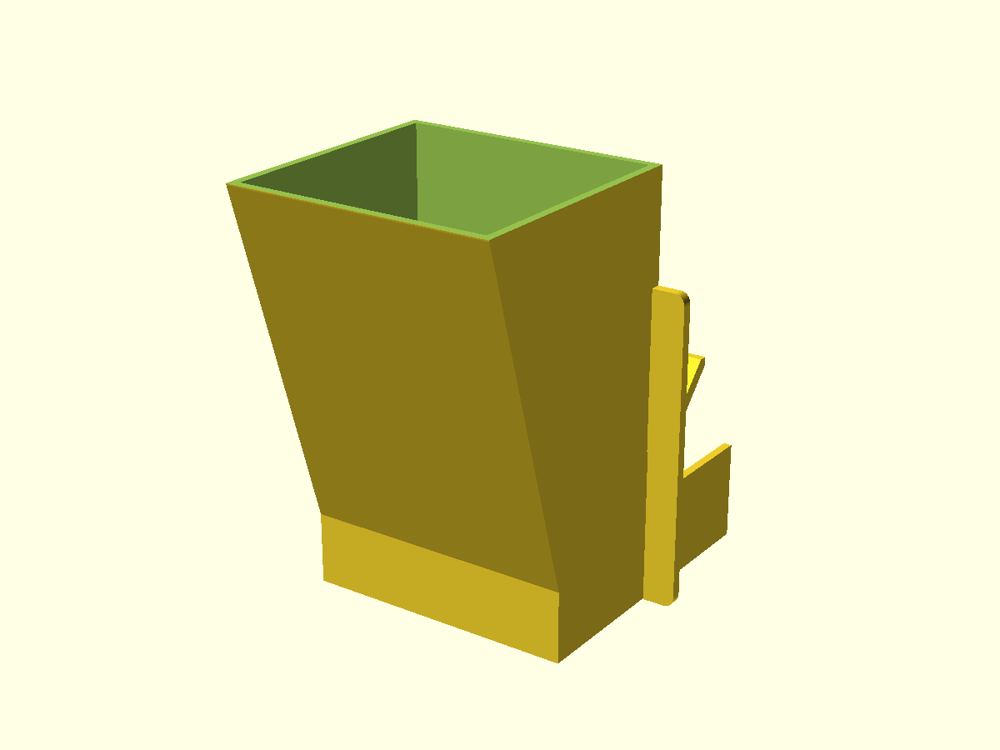
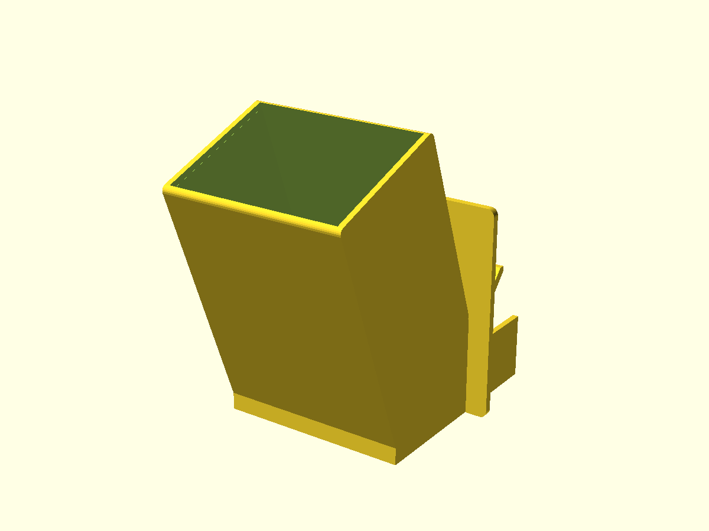
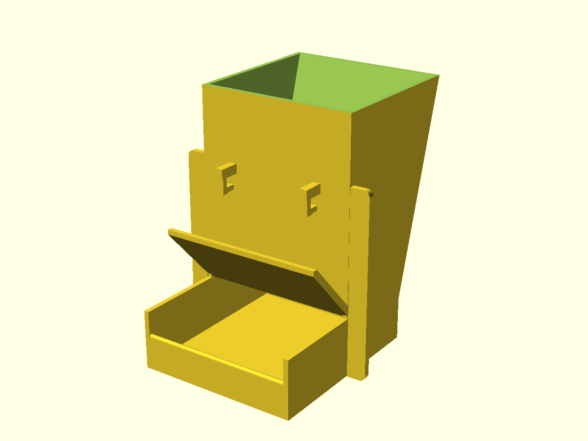
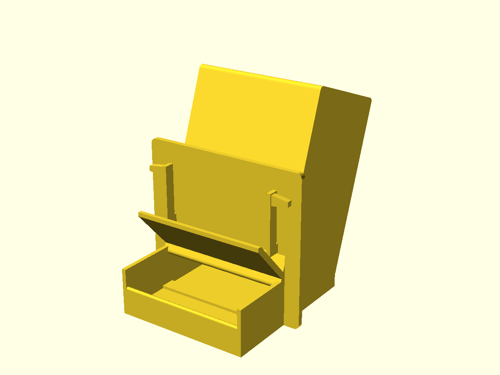
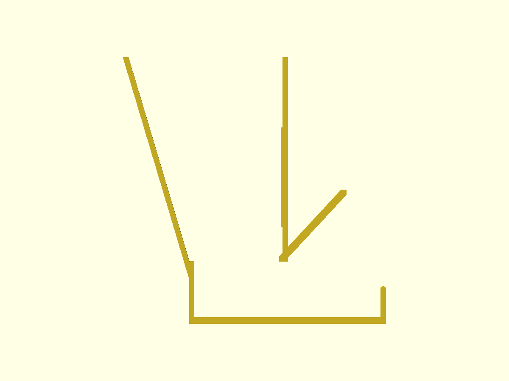
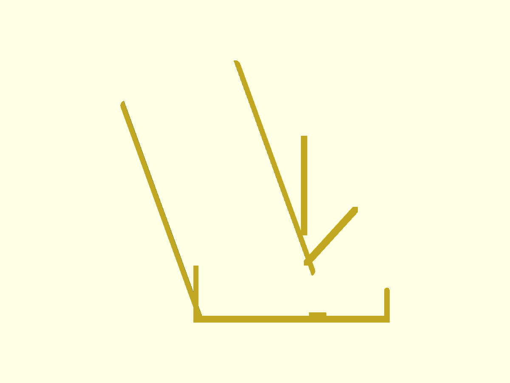

# Conure hopper v3

Two one-piece feeders approach the same small cage door from different mechanical directions. Both use an outside-only open refill mouth, an integral guarded trough, a constant-width seed path, and no lid, seam, fastener, or removable tray. The default model assumes a 110 × 110 mm opening, 12 mm bar spacing, 3.5 mm wire, and 3.2 mm walls. `door_width`, `door_height`, `bar_spacing`, `bar_diameter`, and `wall` are top-level OpenSCAD parameters in both sources.

| | Candidate A — wide-mouth wedge | Candidate B — inclined magazine |
|---|---|---|
| principle | A 98 mm-wide plane-flow wedge expands from a broad outlet toward the refill mouth. Two short-flexure C saddles pass between vertical bars and snap around the top door rail; the outer collar, inner hook wall, and lower return oppose the three removal directions. | A constant 98 × 74 mm passage runs down a 70° inclined tube without changing cross-section. Two long vertical cantilevers pass through the doorway and expand behind its side bars while the outer collar and lower sill seat oppose motion. |
| optimises for | A simple gravity path, lower material use, and a mount that references the top rail instead of the exact side-jamb width. | The largest banana clearance and plug-like flow through a non-converging passage, with two-point snap retention at the door sides. |
| trade-off | The 52.074 mm outlet is only 2.08 times a 25 mm slice, and the hooks require bar gaps at their parameter-derived centres. | The 74.003 mm outlet is 2.96 times a slice, but the snap flange depends more directly on measured door width and requires elastic flexure. |
| printed | Yes. | No: a wall standing on the trough floor behind the magazine outlet forms a pocket at the back of the trough that holds seed for long periods instead of passing it, and how its cantilever mount would seat on a real door is not evident from the model, so the mount cannot be judged before printing. |
| STL | [candidate_a.stl](candidate-a/out/candidate_a.stl) | [candidate_b.stl](candidate-b/out/candidate_b.stl) |
| source | [hopper.scad](candidate-a/hopper.scad) | [hopper.scad](candidate-b/hopper.scad) |
| outside |  |  |
| cage side |  |  |
| section |  |  |

## What informed the geometry

Commercial gravity cage feeders commonly combine outside filling, a seed guard, and a gravity-fed tray; the [JW Clean Seed Silo](https://www.petmate.com/products/jw-clean-seed-silo-bird-feeder) is a compact example. Hooded feeder systems use an external mount and a guarded dish to reduce contamination and escape risk, as described for the [Friendly Feeder](https://www.customcages.com/accessories/friendly-feeder-systems.html) and the [JW Clean Cup](https://www.zen-imal.com/us/insight-cup-feeder-small.html). A documented cage feeder also combines outside mounting with high rear and side cup walls ([US20050028749A1](https://patents.google.com/patent/US20050028749A1/en)). Those mechanisms led to the outer collars, guarded troughs, and inaccessible refill mouths here.

Bulk-solids guidance identifies arching at an undersized outlet and ratholing where only a central core moves; mass flow instead requires sufficiently steep, low-friction walls and an outlet large enough for the material ([Jenike & Johanson](https://jenike.com/solutions/solve-or-prevent-poor-flow/)). That evidence supports the constant-width paths and large outlets, but it does not establish flow for this particular seed-and-banana mix. The STL measurements provide geometry evidence only; a filled bench test remains necessary before unattended use.

## Computed comparison

`verify.py` regenerates capacity, outlet, door-section, cage-contact, and forced-motion solids from each source, then measures the meshes with trimesh. The through-opening count is the genus of the final shell, the number of independent tunnels through the solid. The refill mouth, the outlet, and the open trough form one tunnel, so the intended value is 1; a second passage from the reservoir to the outside raises it and fails the check. The committed default results are in [verification.json](verification.json).

| mesh-derived result | A | B |
|---|---:|---:|
| bodies / watertight / through-openings | 1 / yes / 1 | 1 / yes / 1 |
| bounding box, mm | 130 × 160.177 × 162.75 | 130 × 170.167 × 165.482 |
| reservoir capacity | 1.0069 L | 1.0008 L |
| refill mouth | 98 × 93.866 mm | 98 × 74.02 mm |
| outlet | 98 × 52.074 mm | 98 × 74.003 mm |
| outlet / 25 mm slice | 2.08× | 2.96× |
| shallowest flow wall | 73.41° | 70.00° |
| material through door plane | 104.4 mm wide | 104.4 mm wide |
| clearance in 110 mm opening | 2.8 mm per side | 2.8 mm per side |
| clearance in 107 mm opening | 1.3 mm per side | 1.3 mm per side |
| representative structural wall probes | 3.2 / 4.25 / 3.2 mm | 3.2 / 3.2 / 3.2 mm |
| build-plate contact | 12,598.4 mm² | 13,013.6 mm² |
| downward area steeper than 45° | 830.3 mm² | 1,115.2 mm² |

The generated cage intersection is empty in each mounted pose, and generated probes find no material across either refill mouth or outlet. Forced escape checks are non-empty: A intersects the cage after a 7 mm outward displacement and after a 5 mm lift; B intersects after a 3 mm outward displacement. These are geometric obstruction checks, not strength or fatigue tests. At default width, both 104.4 mm door sections also fit a 107–113 mm opening without scaling; changing the door parameters is preferable after measurement because the mounting features regenerate with them. A's 3.2 mm hook throats require 0.3 mm deflection around the default 3.5 mm rail; the lower tongues are about 10.5 mm long, giving a simple cantilever screening strain of `1.5 × 3.2 × 0.3 / 10.5²` = 1.3%. B's vertical flexures have a 35 mm free length and require about 5 mm tip displacement; the equivalent estimate is `1.5 × 3.2 × 5 / 35²` = 2.0%. Both require printed recovery tests.

## Printing and use

Print either STL upright on its broad trough underside with PETG, four or more perimeters, a 3 mm brim, and automatic support everywhere. The rising hood roofs are steeper than 45°, the reservoir interiors stay open, and only local bridge, rim, and mount surfaces need support. The largest supported surface in A is the 98 × 5 mm underside where the front wall meets the hood roof, 34 mm above the trough floor and reachable only through the hood mouth; check under the hood for leftover support before use. Both measured bounding boxes fit the 180 mm cube. All food-facing shell probes are at least 3.2 mm, front lips are rolled, and exposed side-wall tops are round. Layer steps on the 70–73° flow walls are shallow but still present in this upright orientation.

A PrusaSlicer 2.9.4 dry-run using the committed PETG profile, 0.2 mm layers, four perimeters, 20% gyroid infill, a 3 mm brim, and automatic supports exported both G-codes inside a 180 × 180 × 180 mm volume. A used 335.24 g with a 23 h 35 m normal estimate; B used 366.57 g with a 26 h 38 m estimate. These are comparative toolpath checks rather than Bambu Studio production profiles or physical prints.

Push only the tray and hood through the open feeder door. For A, raise the feeder about 8.5 mm above its seated height, pass the two saddles through bar gaps, push their open bottoms beyond the top rail, and lower the feeder while the two short lower tongues flex 0.3 mm around the rail. The rail then rests inside both C pockets, where the tongues obstruct the reverse lift-and-pull sequence in the generated cage; the snap motion still needs confirmation on a physical cage. For B, press the two upper cantilever tips inward while the collar enters, then seat the sill after the barbs clear the side bars. Fill only from the outside top. Before cage use, confirm door clearance, rail capture, flexure recovery, support removal, smooth food-contact surfaces, and flow with the actual mix. Wash the print and remove it if chewing produces damage or loose plastic.

## Regeneration

From the repository root:

```sh
./build
nix-shell shell.nix --run 'bash hopper/v3/render.sh'
nix-shell -p openscad 'python3.withPackages(ps: with ps; [trimesh numpy rtree networkx scipy])' --run 'python3 hopper/v3/verify.py'
nix-shell -p prusa-slicer --run 'bash hopper/v3/slice.sh'
```
